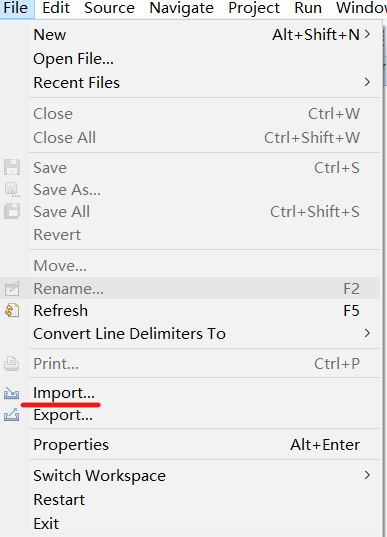
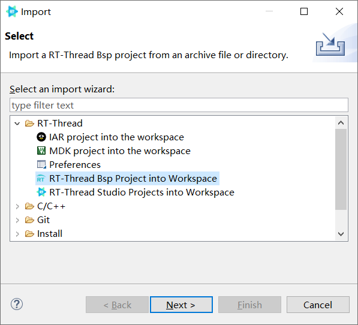

# RT-Thread的Arduino生态兼容层
## RTduino - Arduino Ecosystem Compatibility Layer of RT-Thread
### 如果喜欢请Star，这是对本开源项目最大的鼓励，谢谢；如果想要贡献PR，请fork
--------

## 1 简介

RTduino表示为RT-Thread的Arduino生态兼容层，是RT-Thread的软件包。本软件包旨在兼容Arduino丰富的生态（如Arduino库，以及作品等），来丰富RT-Thread生态，降低RT-Thread操作系统以及与RT-Thread适配的芯片的学习门槛。可以让用户通过Arduino的函数和编程方法，轻松地将RT-Thread以及特定的芯片使用起来。

作为RT-Thread社区用户，你也可以直接使用Arduino社区的库（例如I2C传感器驱动库、算法库等）直接用在RT-Thread工程中，极大地补充了RT-Thread社区生态。

本软件包可以运行在[RT-Thread Studio IDE](https://www.rt-thread.org/page/studio.html)和Keil编译环境下，因为Arduino的库都是基于GCC环境开发的，因此推荐使用RT-Studio运行。

## 2 如何使用本兼容层

本软件包需要对特定的BSP进行适配之后才可以使用，适配方法很简单请参考。本节以[STM32L475潘多拉](https://github.com/RT-Thread/rt-thread/tree/master/bsp/stm32/stm32l475-atk-pandora)、[STM32F072 Nucleo](https://github.com/RT-Thread/rt-thread/tree/master/bsp/stm32/stm32f072-st-nucleo)开发板和[RT-Studio开发环境](https://www.rt-thread.org/page/studio.html)为例，来讲解如何使用本兼容层。

### 2.1 工程的创建和导入

请到[RT-Thread Github官方仓库](https://github.com/RT-Thread/rt-thread)，下载最新的源码。对于部分用户下载Github源码慢的问题，可以百度或者到B站搜索“Github加速”等关键字来解决，此处不再赘述。


下载好之后请解压，打开RT-Studio IDE，选择文件(File) -> 导入(Import)，并选择RT-Thread BSP Project into Workspace，也就是将BSP工程导入到Studio的选项。





路径选择，你刚刚下载解压好的RT-Thread源码，以STM32L475潘多拉板为例：`rt-thread\bsp\stm32\stm32l475-atk-pandora`。工程名字随便起一个就好，比如`STM32`：


点击完成(Finish)，稍等片刻即可完成工程导入。

导入成功之后，双击RT-Thread Settings，进入到RT-Thread工程配置界面，点击<<按钮，进入到详细配置页面：


点击Hardware，选择Support Arduino，只需要点一下即可，其他依赖项会自动处理。然后点击小锤子按钮进行编译，RT-Thread Studio会自动保存你当前的配置并下载RTduino软件包以及依赖项软件包，并将这些软件包加入到工程中，最后自动编译整个工程。

总的来讲，你只需要选择Support Arduino，并点一下小锤子按钮，就坐等编译成功即可。


至此，RTduino软件包安装完成，此BSP工程已经具备了兼容Arduino生态的能力。

### 2.2 RTduino文件夹目录结构

RTduino软件包包含有两个主要的文件夹：core和libraries。

- core文件夹主要是提供Arduino内置的所有的API函数，例如analogWrite、analogRead函数等等，这些函数可以在[Arduino官方](https://www.arduino.cc/reference/en/)找到详细的介绍。

- libraries文件夹是Arduino库所在文件夹。其中：

  - buildin文件夹下存放着Arduino内置的一些库，例如Servo舵机驱动库，Wire I2C驱动库等等；

  - fork文件夹是保存着一些Arduino社区比较重要的第三方库，这些库不能直接移植到RT-Thread上来，需要进行一些适配，因此保存在这里；

  - user文件夹是用户文件夹，这是对用户来说很重要的一个文件夹，里边默认是空的，用户可以把下载好的Arduino库拖入到此文件夹中来，在下个章节会细说这个操作。

### 2.3 Arduino经典的setup和loop函数在哪里？

对于Arduino，最经典的莫过于setup和loop函数。以潘多拉板为例，这两个函数位于：`bsp/stm32/stm32l475-atk-pandora/applications`文件夹下，在开启RTduino软件包后，你可以直接在工程的Applications组中找到它。

### 2.4 点一个LED灯吧！

```c
#include <Arduino.h>

void setup(void)
{
    // put your setup code here, to run once:
    pinMode(LED_BUILTIN, OUTPUT);
}

void loop(void)
{
    // put your main code here, to run repeatedly:
    digitalWrite(LED_BUILTIN, !digitalRead(LED_BUILTIN));
    Serial.println("Hello Arduino!");
    delay(100);
}
```

可以看到，板载的LED灯已经开始闪烁，串口开始输出了。

> 注意：
>
> 由于RT-Thread的main.c文件内，也会默认闪烁一个LED灯，如果板子上只有一个LED灯的话，两个线程会发生干涉。但是你会发现这个LED的闪烁速度明显变快了。因为main.c那边的闪烁周期是1000ms，上面这个例程是200ms。
>
> 如果你用潘多拉板，main.c闪烁的是红灯，RTduino兼容层的Arduino程序默认闪烁的是绿色的灯，二者不会发生干扰。

### 2.5 具体Arduino引脚分布信息

由于每个BSP的板子设计、以及芯片型号等，引脚分布是有区别的，因此需要到指定BSP的`applications/arduino`文件夹下的README.md文件查看详细信息。例如：

[STM32L475潘多拉板的Arduino引脚布局的详细说明](https://github.com/RT-Thread/rt-thread/tree/master/bsp/stm32/stm32l475-atk-pandora/applications/arduino_pinout) | [STM32F072 Nucleo板的Arduino引脚布局的详细说明](https://github.com/RT-Thread/rt-thread/tree/master/bsp/stm32/stm32f072-st-nucleo/applications/arduino_pinout)

## 3 Arduino库的导入

### 3.1 术语说明

软件包：英文为 software package，是指RT-Thread社区所属维护的第三方扩展，是RT-Thread原生生态一部分。

库：英文为library，是指Arduino社区所属维护的第三方扩展，是Arduino原生生态一部分。

>  库和软件包其实是一个意思，只不过两个社区叫法不一样。

### 3.2 RTduino兼容层对Arduino库的兼容情况

目前RTduino兼容层可以实现对Arduino纯软件类（例如算法类、数据处理类等）、串口相关、I2C传感器相关的库做到100%兼容。但是目前还不兼容SPI传感器类的Arduino库。

支持的详细情况和计划，请查看：https://github.com/RTduino/RTduino/issues/2

### 3.3. 导入一个Arduino库到RT-Thread工程（以潘多拉板为例）

首先，你需要到Arduino官方的软件包分类中心去查找你想要的库，或者直接在Github上搜索你想要的库，一般都是C++类型的。比如，我想要一个驱动AHT10温湿度传感器的库，可以在[此处](https://github.com/adafruit/Adafruit_AHTX0)下载。此处以潘多拉板为例，因为潘多拉板板载了AHT10传感器。

下载好之后，直接将zip压缩包拖进RTduino文件夹下的`libraries\user`这个目录下即可。选择当前工程右键选择Sync Sconscript to project也就是让RT-Studio重新扫描并组织一遍工程目录，在扫描的过程中，RT-Studio会自动将zip压缩包解压，并按照Arduino IDE的文件添加逻辑（也就是忽略examples文件夹，并将其他文件夹的.c文件和.h路径添加到工程），将Arduino库添加到RT-Thread工程中来。

然后再点一下小锤子按钮来重新编译一下工程。


工程编译通过之后，你可以将这个AHT10 Arduino库的例程（位于该库文件夹下的examples文件夹）直接复制到arduino_main.cpp文件下运行，你可以看到，串口会输出当前的温湿度，Arduino的例程是直接可以在RT-Thread上运行起来的。

## 4 维护

[Meco Man](https://github.com/mysterywolf) @ RT-Thread Community

软件包地址：https://github.com/RTduino/RTduino

