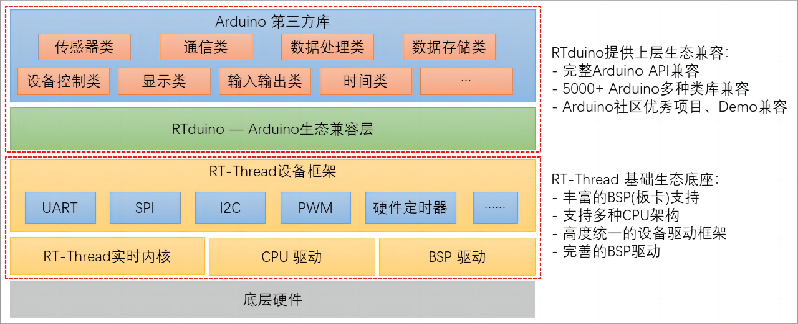

**中文** | [English](README_en.md)

--------

	

<h1 align="center" style="margin: 30px 0 30px; font-weight: bold;">RTduino RT-Thread操作系统的Arduino生态兼容层</h1>
<h3 align="center">RTduino Arduino Ecosystem Compatibility Layer for RT-Thread</h4>

	
	
	
	
	
	

## 1 简介

RTduino是[RT-Thread实时操作系统](https://www.rt-thread.org)的Arduino生态兼容层，为[RT-Thread社区](https://github.com/RT-Thread/rt-thread)的子社区，旨在兼容Arduino社区生态来丰富RT-Thread社区软件包生态（如上千种分门别类的Arduino库，以及Arduino社区优秀的开源项目），并降低RT-Thread操作系统以及与RT-Thread适配的芯片的学习门槛。通过RTduino，可以让用户使用Arduino的函数、编程方法，轻松地将RT-Thread和BSP使用起来。用户也可以直接使用[Arduino社区第三方库](https://www.arduino.cc/reference/en/libraries/)（例如传感器驱动库、算法库等）直接用在RT-Thread工程中，极大地补充了RT-Thread社区生态。

> 注：RTduino 要求 RT-Thread 版本至少为4.1.1

## 2 已经适配RTduino的RT-Thread BSP

目前已经支持RTduino的RT-Thread BSP如下表所示：

| BSP名称                                                                                                                                     | BSP名称                                                                                                                                        |
| ----------------------------------------------------------------------------------------------------------------------------------------- | -------------------------------------------------------------------------------------------------------------------------------------------- |
| [ES32F3696](https://github.com/RT-Thread/rt-thread/tree/master/bsp/essemi/es32f369x/applications/arduino_pinout)                          | [大疆STM32F427 RoboMaster A板](https://github.com/RT-Thread/rt-thread/tree/master/bsp/stm32/stm32f427-robomaster-a/applications/arduino_pinout) |
| [STM32F103 BluePill](https://github.com/RT-Thread/rt-thread/tree/master/bsp/stm32/stm32f103-blue-pill/applications/arduino_pinout)        | [大疆STM32F407 Robomaster C型](https://github.com/RT-Thread/rt-thread/tree/master/bsp/stm32/stm32f407-robomaster-c/applications/arduino_pinout) |
| [STM32F401 BlackPill](https://github.com/RT-Thread/rt-thread/tree/master/bsp/stm32/stm32f401-weact-blackpill/applications/arduino_pinout) | [STM32L431小熊派](https://github.com/RT-Thread/rt-thread/tree/master/bsp/stm32/stm32l431-BearPi/applications/arduino_pinout)                    |
| [STM32F411 BlackPill](https://github.com/RT-Thread/rt-thread/tree/master/bsp/stm32/stm32f411-weact-blackpill/applications/arduino_pinout) | [STM32L475潘多拉](https://github.com/RT-Thread/rt-thread/tree/master/bsp/stm32/stm32l475-atk-pandora/applications/arduino_pinout)               |
| [STM32F072 Nucleo](https://github.com/RT-Thread/rt-thread/tree/master/bsp/stm32/stm32f072-st-nucleo/applications/arduino_pinout)          | [CH32V307V-R1](https://github.com/RT-Thread/rt-thread/tree/master/bsp/wch/risc-v/ch32v307v-r1/applications/arduino_pinout)                   |
| [STM32F401 Nucleo](https://github.com/RT-Thread/rt-thread/tree/master/bsp/stm32/stm32f401-st-nucleo/applications/arduino_pinout)          | [CH32V208W-R0](https://github.com/RT-Thread/rt-thread/tree/master/bsp/wch/risc-v/ch32v208w-r0/applications/arduino_pinout)                   |
| [STM32F410 Nucleo](https://github.com/RT-Thread/rt-thread/tree/master/bsp/stm32/stm32f410-st-nucleo/applications/arduino_pinout)          | [NXP LPC55S69 EVK](https://github.com/RT-Thread/rt-thread/tree/master/bsp/lpc55sxx/lpc55s69_nxp_evk/applications/arduino_pinout)             |
| [STM32F411 Nucleo](https://github.com/RT-Thread/rt-thread/tree/master/bsp/stm32/stm32f411-st-nucleo/applications/arduino_pinout)          | [STM32L476 Nucleo](https://github.com/RT-Thread/rt-thread/tree/master/bsp/stm32/stm32l476-st-nucleo/applications/arduino_pinout)             |
| [STM32F412 Nucleo](https://github.com/RT-Thread/rt-thread/tree/master/bsp/stm32/stm32f412-st-nucleo/applications/arduino_pinout)          | [STM32G474 Nucleo](https://github.com/RT-Thread/rt-thread/tree/master/bsp/stm32/stm32g474-st-nucleo/applications/arduino_pinout)             |
| [STM32F469 Discovery](https://github.com/RT-Thread/rt-thread/tree/master/bsp/stm32/stm32f469-st-disco/applications/arduino_pinout)        | [STM32U575 Nucleo](https://github.com/RT-Thread/rt-thread/tree/master/bsp/stm32/stm32u575-st-nucleo/applications/arduino_pinout)             |
| [Renesas ra6m3-hmi-board](https://github.com/RT-Thread/rt-thread/tree/master/bsp/renesas/ra6m3-hmi-board/board/rtduino/arduino_pinout)        ||

> 注：RTduino也可以无需适配特定BSP，直接运行在任意RT-Thread BSP上，请参考文档中心*RTduino精简模式*章节。

## 3 做精一块板卡

RTduino/RT-Thread官方本着“做精一块板卡”的原则，在上述已经适配RTduino的RT-Thread BSP中，综合考虑Arduino社区方面的已有资料以及互联网该板卡的资料丰富程度，遴选出来的入门级BSP，并增加了更多的上手资料和教学文档、视频，建议初学者选用：

| BSP名称                                                                                                                            | BSP名称                                                                                                                            |
| -------------------------------------------------------------------------------------------------------------------------------- | -------------------------------------------------------------------------------------------------------------------------------- |
| [STM32F401 Nucleo](https://github.com/RT-Thread/rt-thread/tree/master/bsp/stm32/stm32f401-st-nucleo/applications/arduino_pinout) | [STM32L476 Nucleo](https://github.com/RT-Thread/rt-thread/tree/master/bsp/stm32/stm32l476-st-nucleo/applications/arduino_pinout) |
| [STM32F411 Nucleo](https://github.com/RT-Thread/rt-thread/tree/master/bsp/stm32/stm32f411-st-nucleo/applications/arduino_pinout) |                                                                                                                                  |

## 4 编译工具链与环境

RTduino作为RT-Thread软件包，其本身支持GCC工具链以及Keil AC5、AC6 IDE，但由于Arduino社区第三方库均为GCC工具链下编写，**因此建议使用GCC工具链。RTduino文档中心将完全基于GCC工具链以及 Env + VSCode 编译环境来进行讲解**。

## 5 官网与代码仓库

- 官网: http://www.rtduino.com/
- Github代码仓库: https://github.com/RTduino/RTduino
- Gitee代码仓库: https://gitee.com/rtduino/RTduino
- 文档中心（Github）：https://rtduino.github.io/RTduino/#/
- 文档中心（Gitee）：https://rtduino.gitee.io

## 6 感谢以下小伙伴对本仓库的贡献

