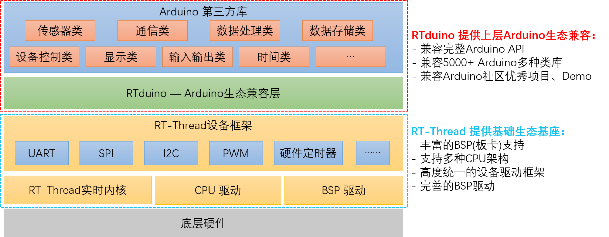

**中文** | [English](README_en.md)

--------

	

<h1 align="center" style="margin: 30px 0 30px; font-weight: bold;">RTduino RT-Thread操作系统的Arduino生态兼容层</h1>
<h3 align="center">RTduino Arduino Ecosystem Compatibility Layer for RT-Thread</h4>

	
	
	
	
	
	

## 1 简介

RTduino是[RT-Thread实时操作系统](https://www.rt-thread.org)的Arduino生态兼容层，为[RT-Thread社区](https://github.com/RT-Thread/rt-thread)的子社区，旨在兼容Arduino社区生态来丰富RT-Thread社区软件包生态（如上千种分门别类的Arduino库，以及Arduino社区优秀的开源项目），并降低RT-Thread操作系统以及与RT-Thread适配的芯片的学习门槛。通过RTduino，可以让用户使用Arduino的函数、编程方法，轻松地将RT-Thread和BSP使用起来。用户也可以直接使用[Arduino社区第三方库](https://www.arduino.cc/reference/en/libraries/)（例如传感器驱动库、算法库等）直接用在RT-Thread工程中，极大地补充了RT-Thread社区生态。

> 注：RTduino 要求 RT-Thread 版本至少为4.1.1

## 2 已经适配RTduino的RT-Thread BSP

请参见 RTduino 文档中心[BSP开发与板卡烧录](https://docs.rtduino.com/#/zh/beginner/bsp-develop?id=_2-%e5%b7%b2%e7%bb%8f%e6%94%af%e6%8c%81rtduino%e7%9a%84bsp)章节。

## 3 编译工具链与环境

RTduino作为RT-Thread软件包，其本身支持GCC工具链以及Keil AC5、AC6 IDE，但由于Arduino社区第三方库均为GCC工具链下编写，**因此建议使用GCC工具链。RTduino文档中心将完全基于GCC工具链以及 Env + VSCode 编译环境来进行讲解**。

## 4 官网与代码仓库

- 官网: http://www.rtduino.com/
- Github代码仓库: https://github.com/RTduino/RTduino
- Gitee代码仓库: https://gitee.com/rtduino/RTduino
- 文档中心（全球）：https://docs.rtduino.com
- 文档中心（国内）：https://rtduino.gitee.io/docs

## 5 感谢以下小伙伴对本仓库的贡献

