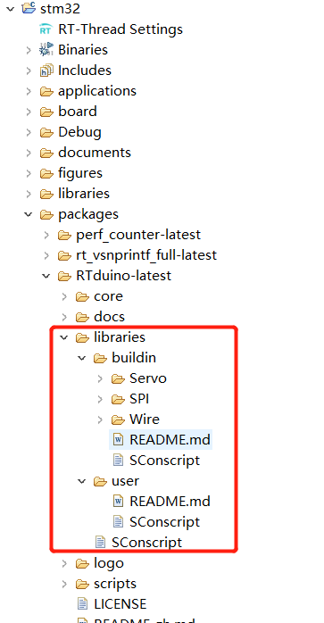
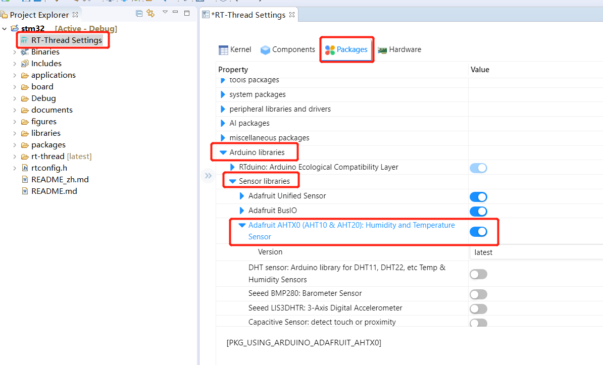
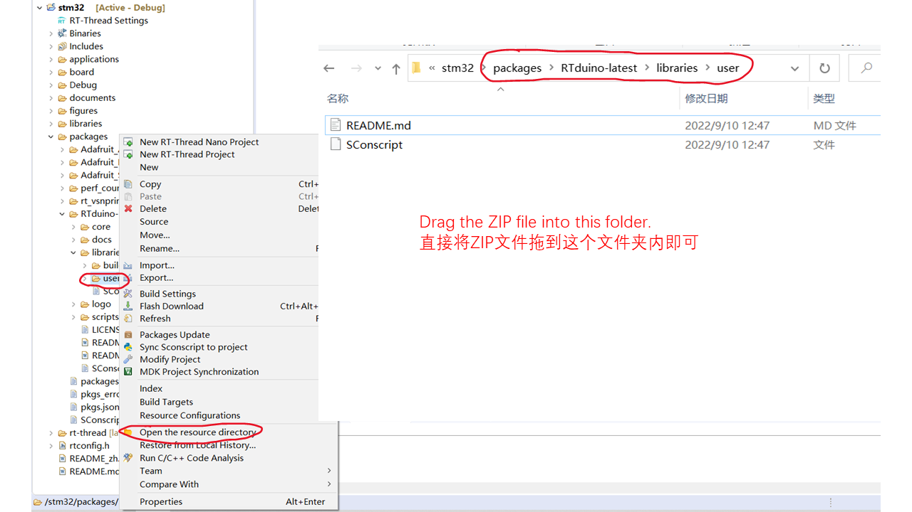
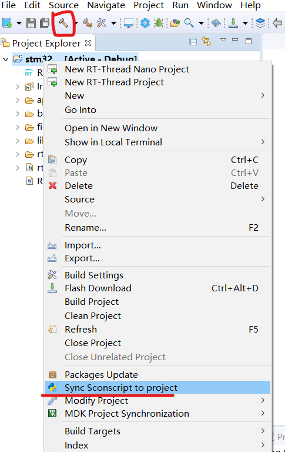
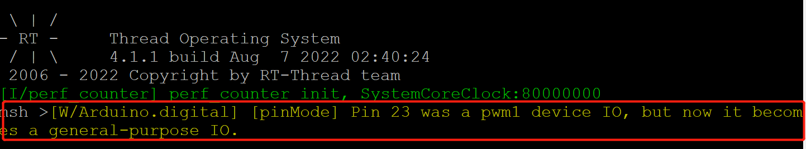

# Arduino Ecosystem Compatibility Layer for RT-Thread

### Please Star this project if you like it. Thank you!

[中文](README.md) | **English**

--------


## 1 Introduction

RTduino is the Arduino ecosystem compatibility layer for [RT-Thread RTOS](https://www.rt-thread.io). RTduino is the sub-community of [RT-Thread community](https://github.com/RT-Thread/rt-thread) and the downstream project of Arduino. RTduino is an open source project which is compatible with Arduino APIs so that RT-Thread beginners can easily get start to use RT-Thread through Arduino APIs, which significantly reduces the difficulty of learning RT-Thread. Meanwhile, RT-Thread users also can directly run thousands of [Arduino third party libraries](https://www.arduino.cc/reference/en/libraries/) on RT-Thread by using RTduino.

Using the RTduino and Arduino libraries will be very easy through the [RT-Thread Studio](https://www.rt-thread.io/studio.html) integrate development environment (IDE) with GUI configurations.

### 1.1 RT-Thread BSPs which have supported RTduino

| BSP List                                                     | BSP List                                                     |
| ------------------------------------------------------------ | ------------------------------------------------------------ |
| [ES32F3696](https://github.com/RT-Thread/rt-thread/tree/master/bsp/essemi/es32f369x/applications/arduino_pinout) | [DJI STM32F427 Robomaster Type A](https://github.com/RT-Thread/rt-thread/tree/master/bsp/stm32/stm32f427-robomaster-a/applications/arduino_pinout) |
| [STM32F103 BluePill](https://github.com/RT-Thread/rt-thread/tree/master/bsp/stm32/stm32f103-blue-pill/applications/arduino_pinout) | [DJI STM32F407 Robomaster Type C](https://github.com/RT-Thread/rt-thread/tree/master/bsp/stm32/stm32f407-robomaster-c/applications/arduino_pinout) |
| [STM32F401 BlackPill](https://github.com/RT-Thread/rt-thread/tree/master/bsp/stm32/stm32f401-weact-blackpill/applications/arduino_pinout) | [TM32L431 Bear Pi](https://github.com/RT-Thread/rt-thread/tree/master/bsp/stm32/stm32l431-BearPi/applications/arduino_pinout) |
| [STM32F411 BlackPill](https://github.com/RT-Thread/rt-thread/tree/master/bsp/stm32/stm32f411-weact-blackpill/applications/arduino_pinout) | [STM32L475 Pandora](https://github.com/RT-Thread/rt-thread/tree/master/bsp/stm32/stm32l475-atk-pandora/applications/arduino_pinout) |
| [STM32F072 Nucleo](https://github.com/RT-Thread/rt-thread/tree/master/bsp/stm32/stm32f072-st-nucleo/applications/arduino_pinout) | [CH32V307V-R1](https://github.com/RT-Thread/rt-thread/tree/master/bsp/wch/risc-v/ch32v307v-r1/applications/arduino_pinout) |
| [STM32F401 Nucleo](https://github.com/RT-Thread/rt-thread/tree/master/bsp/stm32/stm32f401-st-nucleo/applications/arduino_pinout) | [CH32V208W-R0](https://github.com/RT-Thread/rt-thread/tree/master/bsp/wch/risc-v/ch32v208w-r0/applications/arduino_pinout) |
| [STM32F410 Nucleo](https://github.com/RT-Thread/rt-thread/tree/master/bsp/stm32/stm32f410-st-nucleo/applications/arduino_pinout) | [NXP LPC55S69 EVK](https://github.com/RT-Thread/rt-thread/tree/master/bsp/nxp/lpc/lpc55sxx/lpc55s69_nxp_evk/applications/arduino_pinout) |
| [STM32F411 Nucleo](https://github.com/RT-Thread/rt-thread/tree/master/bsp/stm32/stm32f411-st-nucleo/applications/arduino_pinout) | [STM32L476 Nucleo](https://github.com/RT-Thread/rt-thread/tree/master/bsp/stm32/stm32l476-st-nucleo/applications/arduino_pinout) |
| [STM32F412 Nucleo](https://github.com/RT-Thread/rt-thread/tree/master/bsp/stm32/stm32f412-st-nucleo/applications/arduino_pinout) | [STM32G474 Nucleo](https://github.com/RT-Thread/rt-thread/tree/master/bsp/stm32/stm32g474-st-nucleo/applications/arduino_pinout) |
| [STM32F469 Discovery](https://github.com/RT-Thread/rt-thread/tree/master/bsp/stm32/stm32f469-st-disco/applications/arduino_pinout) | [STM32U575 Nucleo](https://github.com/RT-Thread/rt-thread/tree/master/bsp/stm32/stm32u575-st-nucleo/applications/arduino_pinout) |
| [Renesas ra6m3-hmi-board](https://github.com/RT-Thread/rt-thread/tree/master/bsp/renesas/ra6m3-hmi-board/board/rtduino/arduino_pinout) |                                                              |

> RTduino also allows users to directly run without a specific BSP supporting. Please see Chapter 5

### 1.2 Terms Explanation

[Software Package](https://packages.rt-thread.org/en/index.html): is RT-Thread side third party extension, and belongs to RT-Thread ecosystem.

[Library](https://www.arduino.cc/reference/en/libraries): is Arduino side third party extension, and belongs to Arduino ecosystem.

> Software package and library are the same meaning, but different names for RT-Thread and Arduino communities.

## 2 How to use RTduino

We will use [STM32F103 BluePill BSP](https://github.com/RT-Thread/rt-thread/tree/master/bsp/stm32/stm32f103-blue-pill) as an example to show how to use RTduino.

> RTduino requires the minimum version of RT-Thread is 4.1.1

### 2.1 References

- [How to import a BSP project with latest code into RT-Thread Studio](https://www.youtube.com/watch?v=fREPLuh-h8k)

### 2.2 Import and create a project

[This vedio](https://www.youtube.com/watch?v=fREPLuh-h8k) will also teach you how to import a BSP into RT-Thread Studio as a project

- Please go to the [RT-Thread repository](https://github.com/RT-Thread/rt-thread) to [download](https://github.com/RT-Thread/rt-thread/archive/refs/heads/master.zip) the latest code

- Download and install [RT-Thread Studio IDE](https://www.rt-thread.io/studio.html)

- Unzip the RT-Thread source code file and open RT-Thread Studio


- In RT-Thread Studio IDE, select `File` -> `Import`, and select `RT-Thread BSP Project into Workspace`


- Click `Browse` button and select the Blue Pill BSP folder: `rt-thread\bsp\stm32\stm32f103-blue-pill`. [This video](https://www.youtube.com/watch?v=fREPLuh-h8k) also teaches you how to import a BSP project into RT-Thread Studio. Then, click `Finish` button to let RT-Thread Studio to import the Blue Pill BSP project.


- When importing finished, please click `RT-Thread Settings`. Then, click `<<` button to show the configuration details.


- Click `Hardware`, and select `Compatible with Arduino Ecosystem (RTduino)`. Then, click the "hammer" button to compile the project. RT-Thread Studio will automatically download the RTduino and other dependency software packages and compile the whole project.


- Up to now, this project has supported Arduino programming.

### 2.3 Where is the setup-loop framework

Now, you have successfully create a RT-Thread Blue Pill Board project and allow you to directly use Arduino APIs to drive this board. However,  where is the setup-loop framework, which is very common seen in an Arduino sketch?

Actually, the Arduino sketch is located in `bsp/stm32/stm32f103-blue-pill/applications/arduino_main.cpp`, where is in the `application` folder.


### 2.4 Try to blink a LED!

```c
#include <Arduino.h>

void setup(void)
{
    // put your setup code here, to run once:
    pinMode(LED_BUILTIN, OUTPUT);
}

void loop(void)
{
    // put your main code here, to run repeatedly:
    digitalWrite(LED_BUILTIN, !digitalRead(LED_BUILTIN));
    Serial.println("Hello Arduino!");
    delay(100);
}
```

You will see the LED is blinking and the serial terminal also shows "Hello Arduino!".

There are many other examples and demos at [example folder](https://github.com/RTduino/RTduino/tree/master/examples)

### 2.5 RTduino folder directory structure



There are two main folders in RTduino: core and libraries.

- [core folder](https://github.com/RTduino/RTduino/tree/master/core): contains all Arduino related APIs will be implemented in this folder, such as: digitalRead, analogWrite and so on.
- [libraries folder](https://github.com/RTduino/RTduino/tree/master/libraries)
- [buildin folder](https://github.com/RTduino/RTduino/tree/master/libraries/buildin): contains Arduino build-in libraries such as SPI, Wire (I2C), servo and so on.
- [user folder](https://github.com/RTduino/RTduino/tree/master/libraries/user): this folder is empty by default and it prepares for users to import the Arduino Third Parity libraries. This operation will introduce and explain in the next chapter.

### 2.6 BSP Arduino IO Pinout

You will find more information related a specific BSP Arduino pinout at: `applications/arduino` folder. For Blue Pill BSP, it is located at [here](https://github.com/RT-Thread/rt-thread/tree/master/bsp/stm32/stm32f103-blue-pill/applications/arduino_pinout).

## 3 Arduino Libraries

**Notice: if has any question related the Arduino (third-party) libraries, please open an issue and report in this repository.**

### 3.1 Arduino Build-in Libraries

RTduino has supported most of [Arduino build-in libraries](https://github.com/arduino/ArduinoCore-avr/tree/master/libraries), where is in the folder `libraries/buildin`. The following table will show the details:

| Library   | Enable Macro            | Note                                                                                                                                                 |
| --------- | ----------------------- | ---------------------------------------------------------------------------------------------------------------------------------------------------- |
| Servo     | RTDUINO_USING_SERVO     | Enable by default if PWM is available.                                                                                                               |
| SPI       | RTDUINO_USING_SPI       | Enable by default if SPI is available.                                                                                                               |
| Wire      | RTDUINO_USING_WIRE      | Enable by default if I2C is available.                                                                                                               |
| USBSerial | RTDUINO_USING_USBSERIAL | Enable manually if is needed, and rely on the [TinyUSB for RT-Thread](https://github.com/RT-Thread-packages/tinyusb) software package automatically. |

### 3.2 Enable Arduino Third Party libraries through RT-Thread software center

In RT-Thread software center, there is a specific category for Arduino. RTduino community will register some important and frequent to use Arduino third party libraries to RT-Thread software package center, so that users can directly use those libraries with GUI configuration in RT-Thread Studio.

The following example will show how to enable Arduino Adafruit AHTx0 sensor driver library with a few clicks:

- Please follow the previous chapter to import a project into RT-Thread Studio and select `Compatible with Arduino Ecosystem (RTduino)` in RT-Thread Settings.

- Please to go `Software` column, and select `Arduino libraries` category, and extend `Sensors` sub-category of Arduino library. Then, select and enable the Adafruit AHTx0 Arduino driver library. RT-Thread Studio will help you to enable other dependency libraries, such as Adafruit Unified Sensor library, Adafruit BusIO library and so on.



- Click hammer to compile the project. RT-Thread Studio will automatically download the software packages and libraries and compile the whole project.


- When the compiling finishes, you can copy the example code of AHTx0 library, where is in the example folder, and paste it into `arduino_main.cpp` file. Then, compile the project again and download the program into the board. You will see the current sensor data will show on the terminal. Now, we have successfully directly run Arduino library on RT-Thread.

### 3.3 Import Third Party Arduino Libraries Manually

You also can directly import an Arduino library manually, which has not been registered into RT-Thread software package center. This operation also is very easy.

- You need to download the library from github or other repository and directly drag the ZIP file into `libraries\user` folder, and you don't need to decompress the ZIP file.



- Then, go to RT-Thread Studio, right click the project, select `Sync Sconscript to project` and click hammer to compile the project again.



- When the compiling finishes, you will find the new library is shown on the project, where is in the `libraries\user` folder of the project group.

## 4 How to support RTduino for a RT-Thread BSP

## 5 RTduino Tiny Mode

## 6 Matters needing attention

### 6.1 PWM feature pins cannot invoke `pinMode` function

PWM, ADC or DAC feature pins cannot invoke `pinMode` function to set as the GPIO, otherwise, the pins will lose the PWM, ADC or DAC features.

```c
void setup() {
  //pinMode(led_pin, OUTPUT); //Cannot use PinMode function, otherwise, led_pin will lose the PWM feature.
}
void loop() {
  //Fading the LED
  for(int i=0; i<255; i++){
    analogWrite(led_pin, i);
    delay(5);
  }
  for(int i=255; i>0; i--){
    analogWrite(led_pin, i);
    delay(5);
  }
}
```

Arduino [official document](https://www.arduino.cc/reference/en/language/functions/analog-io/analogwrite/) also suggests:

```markdown
You do not need to call pinMode() to set the pin as an output before calling analogWrite().
The analogWrite function has nothing to do with the analog pins or the analogRead function.
```

If users use pinMode to set a PWM, ADC or DAC feature pin, RTduino also will gives an warning in terminal.



Of course, if the user already knows the consequences of doing so, it is completely possible to deliberately convert the PWM, ADC or DAC pins to ordinary IOs through the pinMode function.

### 6.2 `Serial.begin()`

Many Arduino example sketches ues `Serial.begin(9600)` to initialize serials. However, in RTduino, it is **highly suggested** users to use `Serial.begin()`, which is without bond parameter to initialize the serial, so that it can follow the original RT-Thread serial bond rate settings, which is 115200 by default for most of the BSPs. Unless you want to change the serial bond rate in RTduino sketch.

### 6.3 `SPI.begin()` / `Wire.begin()`

When operating SPI and Wire (I2C), the RT-Thread SPI and I2C devices called by default are defined in arduino_pin.h. When users use SPI and Wire libraries, they do not need to specify SPI and I2C devices, which is no different from using Arduino. If you use a non-default SPI/I2C, you only need to pass in the corresponding rt-thread device name in the initialization function, such as `SPI.begin("spi1")` or `Wire.begin("i2c1")`.

## 7 How to adapt an Arduino library to RTduino

Some Arduino libraries will be adapted differently according to different architectures (including CPU architecture or different board structures). For RTduino, the recognition macro is `ARDUINO_ARCH_RTTHREAD`. Please refer to this [commit](https://github.com/PaulStoffregen/CapacitiveSensor/commit/25dd066f412af0c988aa3712bebfcb263c9054e0#diff-5957e867d92ebf881ddfc665f29824357eab87f987c6097dc8958d9053c6e6f7R387) for adaptation.

## 8 Contribution and Maintenance

### 8.1 Project repository

https://github.com/RTduino/RTduino

https://gitee.com/rtduino/RTduino

### 8.2 Thanks for the community contributors

<a href="https://github.com/RTduino/rtduino/graphs/contributors">
  
</a>
