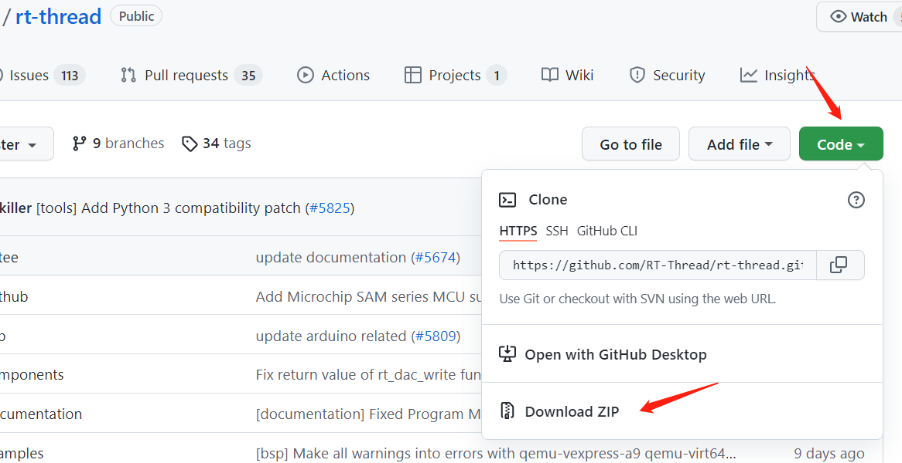
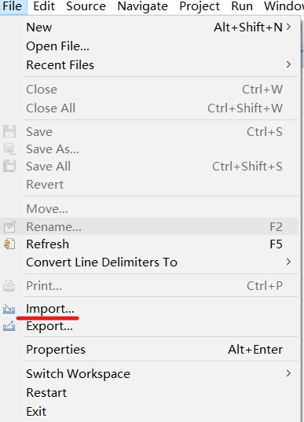
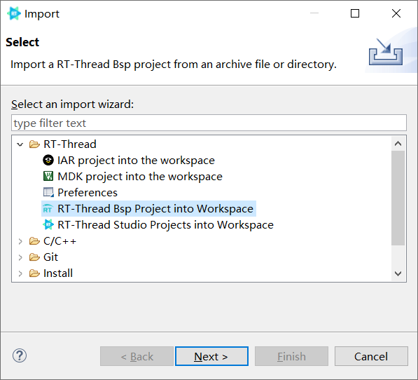
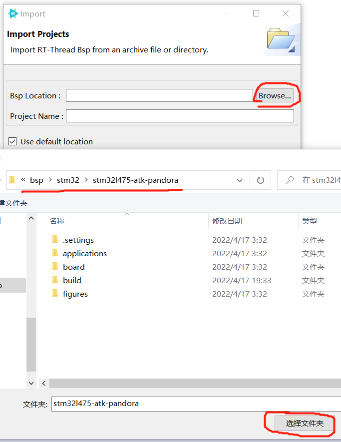
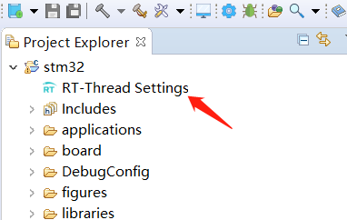
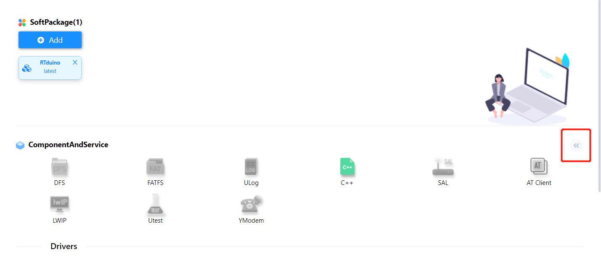
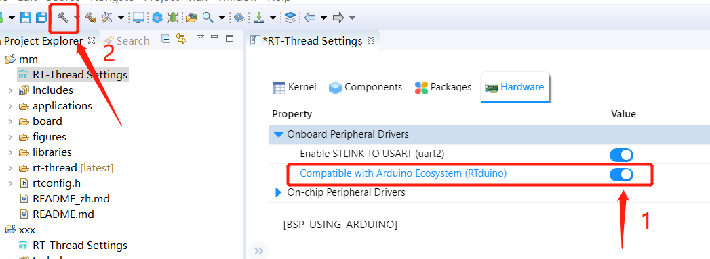

# 5.使用RT-Thread Studio IDE创建工程

## 5.1 RTduino社区开发版工程创建方法

RTduino社区开发版使用RT-Thread最新代码 + RTduino最新代码的方式进行开发。

本节以[STM32L475潘多拉](https://github.com/RT-Thread/rt-thread/tree/master/bsp/stm32/stm32l475-atk-pandora)开发板和[RT-Studio开发环境](https://www.rt-thread.org/page/studio.html)为例，来讲解如何使用本兼容层。

请到[RT-Thread Github官方仓库](https://github.com/RT-Thread/rt-thread)，下载最新的源码。对于部分用户下载Github源码慢的问题，可以百度或者到B站搜索“Github加速”等关键字来解决，此处不再赘述。

下载好之后请解压，打开RT-Studio IDE，选择文件(File) -> 导入(Import)，并选择RT-Thread BSP Project into Workspace，也就是将BSP工程导入到Studio的选项。

路径选择，你刚刚下载解压好的RT-Thread源码，以STM32L475潘多拉板为例：`rt-thread\bsp\stm32\stm32l475-atk-pandora`。工程名字随便起一个就好，比如`STM32`：

点击完成(Finish)，稍等片刻即可完成工程导入。

导入成功之后，双击RT-Thread Settings，进入到RT-Thread工程配置界面，点击 `<<` 按钮，进入到详细配置页面：

点击Hardware，选择 `Compatible with Arduino Ecosystem (RTduino)`，只需要点一下即可，其他依赖项会自动处理。然后点击小锤子按钮进行编译，RT-Thread Studio会自动保存你当前的配置并下载RTduino软件包以及依赖项软件包，并将这些软件包加入到工程中，最后自动编译整个工程。

总的来讲，你只需要选择 `Compatible with Arduino Ecosystem (RTduino)`，并点一下小锤子按钮，就坐等编译成功即可。

至此，RTduino软件包安装完成，此BSP工程已经具备了兼容Arduino生态的能力。

## 5.2 RTduino发行版工程创建方法

**目前无RTduino发型版发布**
