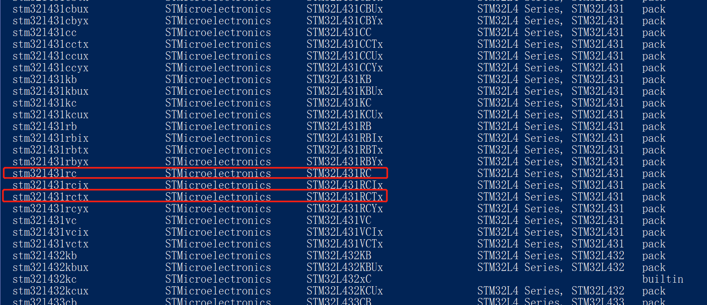
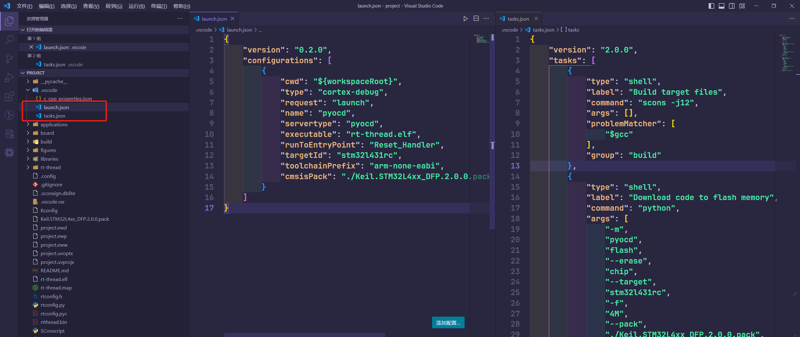
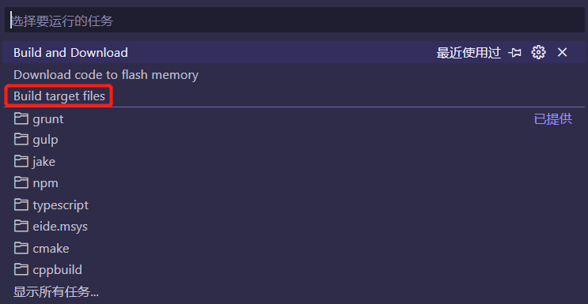
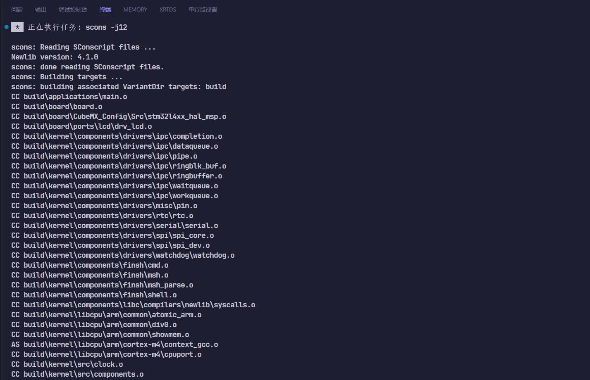
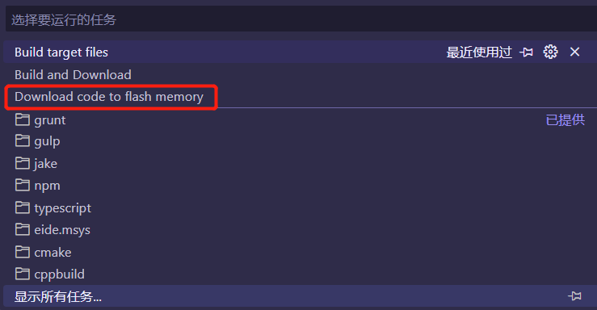
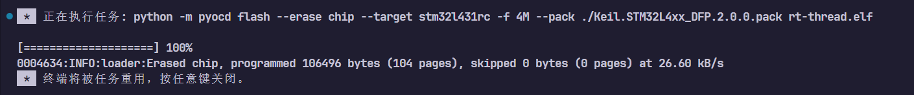
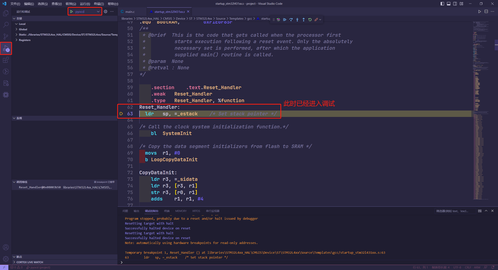
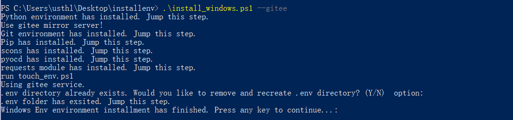
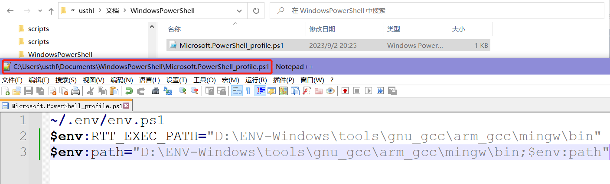

# 6.使用VSCode+Env创建工程

## 3. 编译与烧录

1. 可以在 VSCode 终端中使用 `scons -j20` 编译工程（20为20个CPU核心并行编译，数字根据电脑实际硬件情况选择）。
2. 编译出的 `.bin` 或 `.elf` 文件即可烧入到板卡中。以STM32为例，则使用STM32CubeProgrammer软件将bin或elf文件烧入到板卡中。不同半导体厂商提供的烧录软件不一样，详情需要参考半导体厂商相关资料。

### 在完成上述步骤之后，就可以正常编译RT-Thread BSP工程了，如果想要调试BSP（以STM32为例），可以尝试接下来的步骤。
### 推荐初学者先到此为止

----------------------

## 4. 调试工程与添加关键文件到VsCode工程的.vscode文件夹

### 4.1 安装 VsCode 插件 `Cortex-Debug`

### 4.2 launch.json

该文件主要用于调试。

```json

{
    "version": "0.2.0",
    "configurations": [
        {
            "cwd": "${workspaceRoot}",
            "type": "cortex-debug",
            "request": "launch",
            "name": "pyocd",
            "servertype": "pyocd",
            "executable": "rt-thread.elf",
            "runToEntryPoint": "Reset_Handler",
            "targetId": "stm32l431rc",                      // 需要用户手动更改
            "toolchainPrefix": "arm-none-eabi",
            "cmsisPack": "./Keil.STM32L4xx_DFP.2.0.0.pack"  // 需要用户手动更改
        }
    ]
}

```
以上文件有两个重要的地方需要用户手动修改：

- targetId ： 目标芯片的系列
- cmsisPack ： CMISS pack包所在的路径，可以是相对路径和绝对路径。

> `cmsisPack`可通过网站`https://www.keil.arm.com/packs/`进行下载。
>
> `targetId`的取值可以在终端输入`python -m pyocd list --target --pack pack包所在的路径`来查看。
>
> 例如：`python -m pyocd list --target --pack ./Keil.STM32L4xx_DFP.2.0.0.pack`
>
> 
>
> 所以这里`targetId`的值可以是`stm32l431rc`和`stm32l431rctx`。

### 4.3 tasks.json

该文件主要用于配置 VsCode 的任务，可以将一些重要的指令以任务的形式保存并且快速调用。

```json

{
    "version": "2.0.0",
    "tasks": [
        {
            "type": "shell",
            "label": "Build target files",
            "command": "scons -j12",
            "args": [],
            "problemMatcher": [
                "$gcc"
            ],
            "group": "build"
        },
        {
            "type": "shell",
            "label": "Download code to flash memory",
            "command": "python",
            "args": [
                "-m",
                "pyocd",
                "flash",
                "--erase",
                "chip",
                "--target",
                "stm32l431rc",                          // 需要用户手动更改
                "-f",
                "4M",
                "--pack",
                "./Keil.STM32L4xx_DFP.2.0.0.pack",      // 需要用户手动更改
                "rt-thread.elf"
            ],
            "problemMatcher": [
                "$gcc"
            ],
            "group": "build",
        },
        {
            "type": "shell",
            "label": "Build and Download",
            "command": "python",
            "args": [
                "-m",
                "pyocd",
                "flash",
                "--erase",
                "chip",
                "--target",
                "stm32l431rc",                          // 需要用户手动更改
                "-f",
                "4M",
                "--pack",
                "./Keil.STM32L4xx_DFP.2.0.0.pack",      // 需要用户手动更改
                "rt-thread.elf"
            ],
            "problemMatcher": [
                "$gcc"
            ],
            "group": "build",
            "dependsOn": "Build target files"
        }
    ]
}

```

以上文件有两个重要的地方需要用户手动修改：

- targetId ： 目标芯片的系列
- cmsisPack ： CMISS pack包所在的路径，可以是相对路径和绝对路径。



## 5. 编译工程

通过执行VsCode任务。

终端->运行任务->Build target files





## 6. 下载工程至单片机

终端->运行任务->Download code to flash memory





也可以使用`Build and Download`任务一键编译下载

## 7. 调试工程



具体使用方式可以学习一下VsCode Cortex-Debug 插件的使用，这里不做详细介绍。

## 8. 补充说明

由于RT-Thread 的env-windows软件自带的python版本为python27，版本较低可能会导致一些问题，所以建议大家仅使用RT-Thread的 [简洁版env](https://github.com/RT-Thread/env) 用户可以在此基础上自由配置，比如升级自己的python版本为python3。

具体安装说明请参考：[ENV环境搭建说明文档](https://github.com/RT-Thread/env/tree/master#readme)

按住shift键同时点击鼠标右键，调出PowerShell终端窗口。根据 [ENV环境搭建说明文档](https://github.com/RT-Thread/env/tree/master#readme) 教程，找到自己电脑对应环境的安装命令，进行安装。这里以`Windows 大陆用户`示例安装。

依次执行如下三条命令：
```
wget https://gitee.com/RT-Thread-Mirror/env/raw/master/install_windows.ps1 -O install_windows.ps1
set-executionpolicy remotesigned
.\install_windows.ps1 --gitee
```
出现以下内容表示安装完成，因为本人之前已经安装完成，具体Log信息会有所不同。



安装完ENV后，每次重启 PowerShell 时，都需要输入命令 `~/.env/env.ps1`，以激活环境变量。这样的话还是有点麻烦，这里可以根据 [ENV环境搭建说明文档](https://github.com/RT-Thread/env/tree/master#readme) 中的 **方案 B** 进行设置。



可根据需要在`Microsoft.PowerShell_profile.ps1`文件里自行配置。

在RT-Thread BSP 目录按住shift键和鼠标右键，然后点击`在此处打开PowerShell窗口`来打开终端，在终端使用`scons --target=vsc`生成VsCode工程。

在PowerShell终端输入`code .`来打开VsCode工程。

> 注意：在打开VsCode工程的时候，请务必在PowerShell的终端执行`code .`去打开工程，因为根据上文的描述，在使用RT-Thread ENV环境的时候，需要准备一系列的环境变量，直接打开VsCode工程，可能会因为环境变量缺失而导致一系列的问题。

### 其余步骤参考上文即可。
