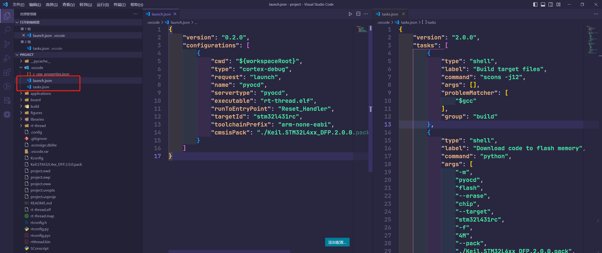
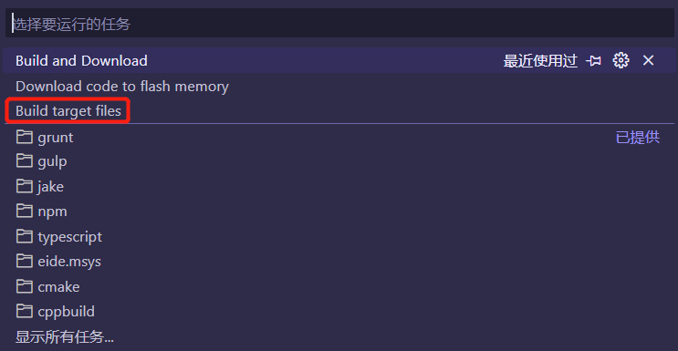

# 使用VsCode开发(编译、下载、调试)项目

## 1. 环境搭建

- RT-Thread ENV V1.4.0+
- VsCode 软件
- VsCode 插件 `Cortex-Debug`

## 2. 生成VsCode工程

在RT-Thread BSP 目录打开ENV终端使用`scons --target=vsc`生成VsCode工程


在ENV终端输入`code .`来打开VsCode工程。

> 注意：在打开VsCode工程的时候，务必通过ENV终端去打开工程，因为RT-Thread的ENV工具，会对系统的环境变量进行单独的配置，比如ENV内部自带的python路径，编译工具链等一些重要环境变量，如果用户不使用此方式去打开VsCode工程，可能会因为环境变量缺失而引起一系列问题。

## 3. 添加关键文件到VsCode工程的.vscode文件夹

### 3.1 launch.json

该文件主要用于调试。

```json

{
    "version": "0.2.0",
    "configurations": [
        {
            "cwd": "${workspaceRoot}",
            "type": "cortex-debug",
            "request": "launch",
            "name": "pyocd",
            "servertype": "pyocd",
            "executable": "rt-thread.elf",
            "runToEntryPoint": "Reset_Handler",
            "targetId": "stm32l431rc",                      // 需要用户手动更改
            "toolchainPrefix": "arm-none-eabi",
            "cmsisPack": "./Keil.STM32L4xx_DFP.2.0.0.pack"  // 需要用户手动更改
        }
    ]
}

```
以上文件有两个重要的地方需要用户手动修改：

- targetId ： 目标芯片的系列
- cmsisPack ： CMISS pack包所在的路径，可以是相对路径和绝对路径。

### 3.2 tasks.json

该文件主要用于配置 VsCode 的任务，可以将一些重要的指令以任务的形式保存并且快速调用。

```json

{
    "version": "2.0.0",
    "tasks": [
        {
            "type": "shell",
            "label": "Build target files",
            "command": "scons -j12",
            "args": [],
            "problemMatcher": [
                "$gcc"
            ],
            "group": "build"
        },
        {
            "type": "shell",
            "label": "Download code to flash memory",
            "command": "python",
            "args": [
                "-m",
                "pyocd",
                "flash",
                "--erase",
                "chip",
                "--target",
                "stm32l431rc",                          // 需要用户手动更改
                "-f",
                "4M",
                "--pack",
                "./Keil.STM32L4xx_DFP.2.0.0.pack",      // 需要用户手动更改
                "rt-thread.elf"
            ],
            "problemMatcher": [
                "$gcc"
            ],
            "group": "build",
        },
        {
            "type": "shell",
            "label": "Build and Download",
            "command": "python",
            "args": [
                "-m",
                "pyocd",
                "flash",
                "--erase",
                "chip",
                "--target",
                "stm32l431rc",                          // 需要用户手动更改
                "-f",
                "4M",
                "--pack",
                "./Keil.STM32L4xx_DFP.2.0.0.pack",      // 需要用户手动更改
                "rt-thread.elf"
            ],
            "problemMatcher": [
                "$gcc"
            ],
            "group": "build",
            "dependsOn": "Build target files"
        }
    ]
}

```

以上文件有两个重要的地方需要用户手动修改：

- targetId ： 目标芯片的系列
- cmsisPack ： CMISS pack包所在的路径，可以是相对路径和绝对路径。



## 4. 编译工程

通过执行VsCode任务。

终端->运行任务->Build target files




## 5. 下载工程至单片机

终端->运行任务->Download code to flash memory


也可以使用`Build and Download`任务一键编译下载

## 6. 调试工程


具体使用方式可以学习一下VsCode Cortex-Debug 插件的使用，这里不做详细介绍。

