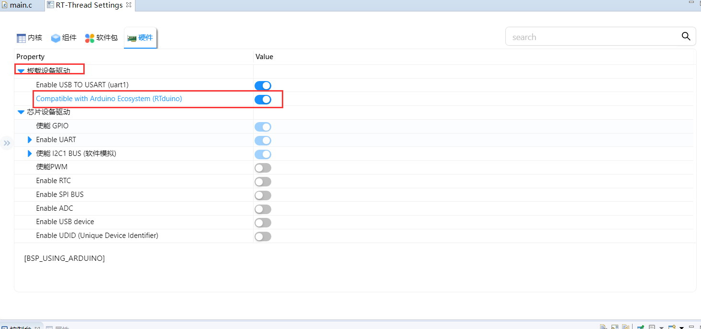
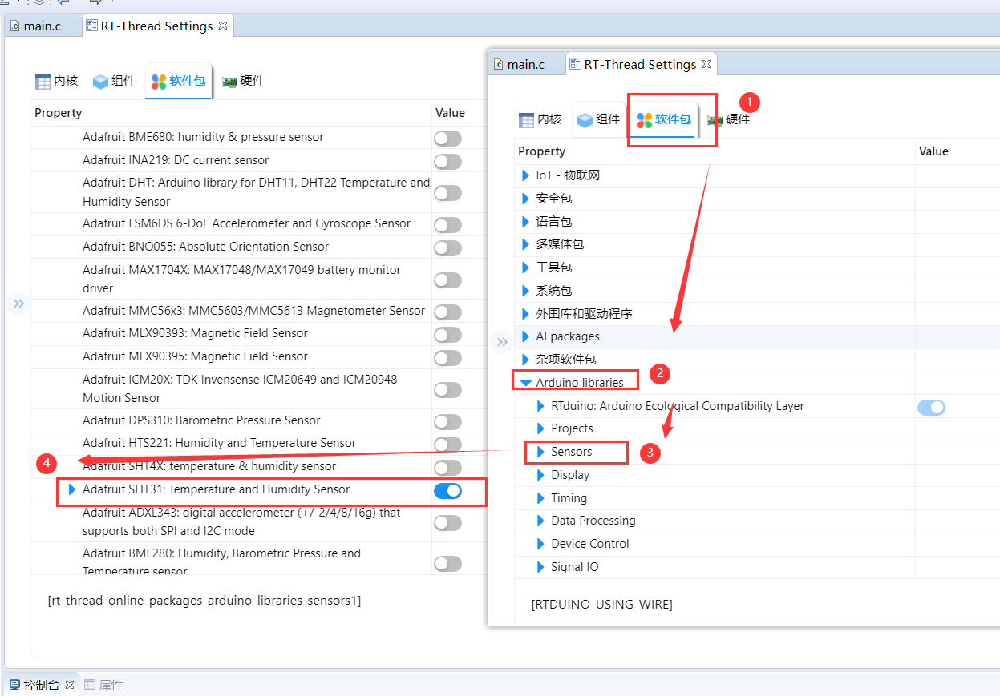
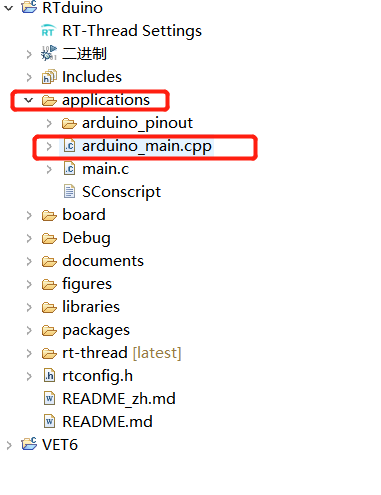
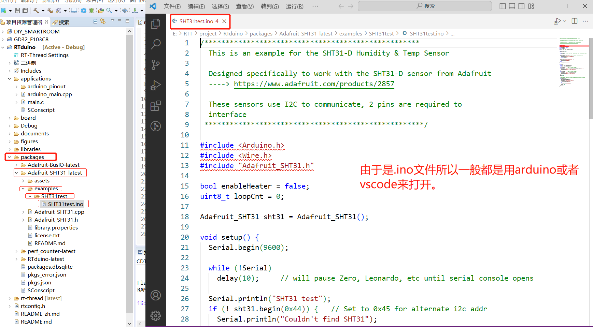
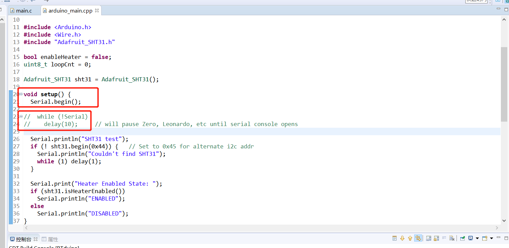
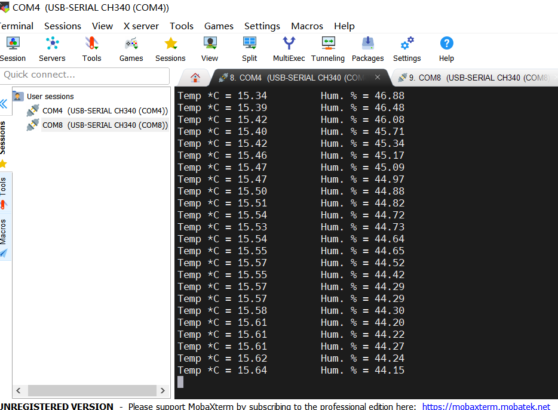

# RT-Thread使用RTduino直接运行Arduino SHT31温湿度传感器驱动库

打开兼容框架:



下一步就是去软件包里面拉去sht31的软件包（同时也是arduino那边的传感器库）。



然后保存后编译一下工程，到这一步基本上是不会报错的，如果报错的话就回头看看前面是否按照步骤来的。然后来到代码编写环节，不同于传统的RTthread编写方式，代码编写需要在arduino_main.c文件下进行。



这时来到packages文件下找到刚刚拉取的sht31软件包。将代码复制粘贴到arduino_main.cpp文件中去，然后开始修改。



主要是修改一下波特率，在arduino给的demo下是初始化的9600，但是我们RTthread使用的是115200，为了不乱码就不给Serial.begin()参数这样就使用RTthread的默认波特率。



最后编译一下代码，同时我也将最终代码放在下面：

```c
/***************************************************
  This is an example for the SHT31-D Humidity & Temp Sensor

  Designed specifically to work with the SHT31-D sensor from Adafruit
  ----> https://www.adafruit.com/products/2857

  These sensors use I2C to communicate, 2 pins are required to
  interface
 ****************************************************/

#include <Arduino.h>
#include <Wire.h>
#include "Adafruit_SHT31.h"

bool enableHeater = false;
uint8_t loopCnt = 0;

Adafruit_SHT31 sht31 = Adafruit_SHT31();

void setup() {
  Serial.begin();

//  while (!Serial)
//    delay(10);     // will pause Zero, Leonardo, etc until serial console opens

  Serial.println("SHT31 test");
  if (! sht31.begin(0x44)) {   // Set to 0x45 for alternate i2c addr
    Serial.println("Couldn't find SHT31");
    while (1) delay(1);
  }

  Serial.print("Heater Enabled State: ");
  if (sht31.isHeaterEnabled())
    Serial.println("ENABLED");
  else
    Serial.println("DISABLED");
}


void loop() {
  float t = sht31.readTemperature();
  float h = sht31.readHumidity();

  if (! isnan(t)) {  // check if 'is not a number'
    Serial.print("Temp *C = "); Serial.print(t); Serial.print("\t\t");
  } else {
    Serial.println("Failed to read temperature");
  }

  if (! isnan(h)) {  // check if 'is not a number'
    Serial.print("Hum. % = "); Serial.println(h);
  } else {
    Serial.println("Failed to read humidity");
  }

  delay(1000);

  // Toggle heater enabled state every 30 seconds
  // An ~3.0 degC temperature increase can be noted when heater is enabled
  if (loopCnt >= 30) {
    enableHeater = !enableHeater;
    sht31.heater(enableHeater);
    Serial.print("Heater Enabled State: ");
    if (sht31.isHeaterEnabled())
      Serial.println("ENABLED");
    else
      Serial.println("DISABLED");

    loopCnt = 0;
  }
  loopCnt++;
}

```

最终运行结果：


