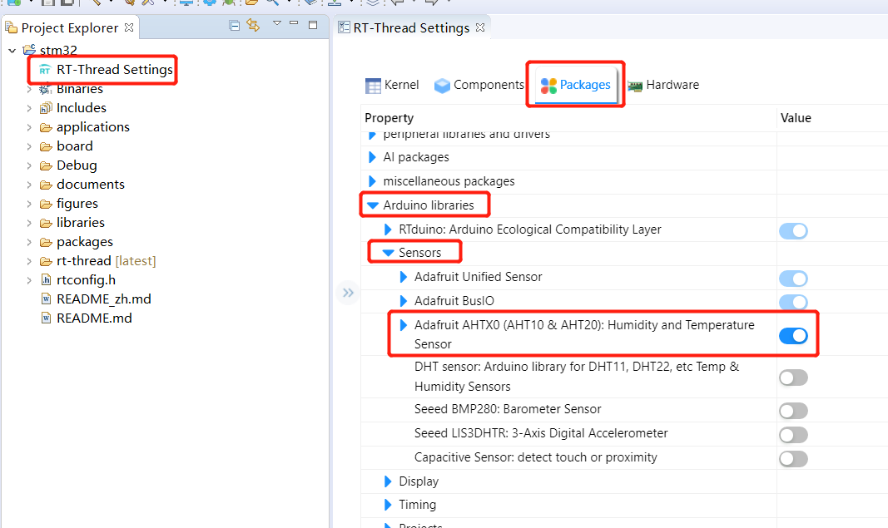
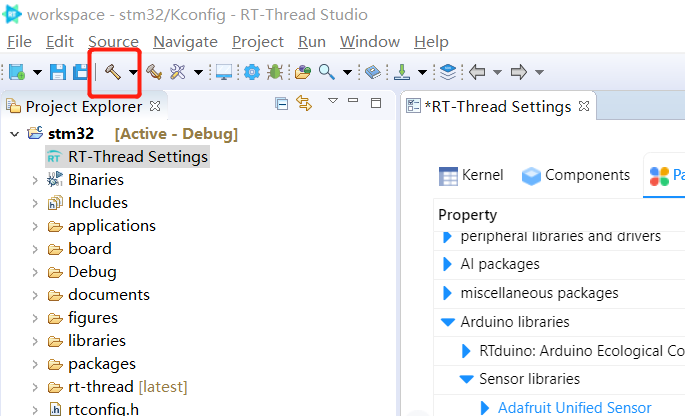

# 7.通过RT-Thread软件包中心加载Arduino库到RT-Thread工程

## 7.1 VSCode + Env 环境

## 7.2 RT-Thread Studio IDE环境

RT-Thread软件包中心为Arduino第三方库专门创建了一个分类，RTduino社区会将Arduino社区中一些常用的、重要的第三方库注册（如驱动库等）到RT-Thread软件包中心中，用户可以通过RT-Thread Studio或者Env工具一键化下载使用。下面以潘多拉板载的AHT10温湿度传感器为例，讲解如何快速使用Arduino的AHT10温湿度传感器驱动：

- 在导入潘多拉BSP后，打开RT-Thread Settings，选择 `Compatible with Arduino Ecosystem (RTduino)`。此时，工程已经具备支持Arduino生态的能力。

- 点击Package栏，选择Arduino软件包分类，找到Sensor分类（Arduino传感器库分类），找到并选择Adafruit AHTx0驱动。此时，RT-Thread Studio会自动选择该库依赖的其他Arduino库，例如Adafruit Unified Sensor库以及Adafruit BusIO库等。

- 然后点击小锤子编译，RT-Thread Studio会自动下载这些软件包并将工程整体编译一遍。

- 工程编译通过之后，你可以将Adafruit AHTx0库的例程（位于该库文件夹下的examples文件夹）直接复制到arduino_main.cpp文件下运行，你可以看到，串口会输出当前的温湿度，Arduino的例程是直接可以在RT-Thread上运行起来的。
