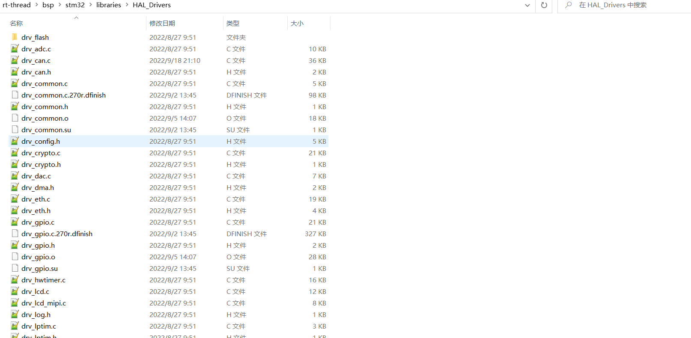
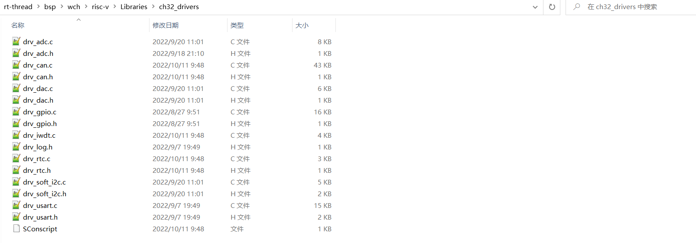
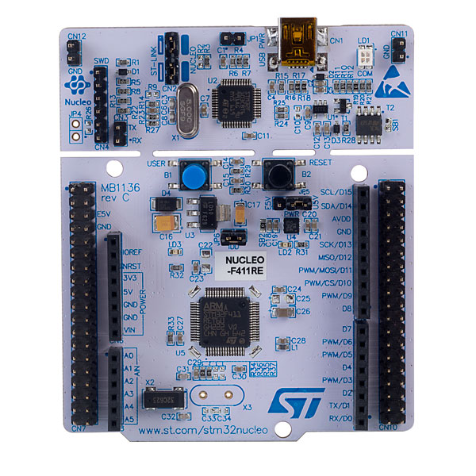
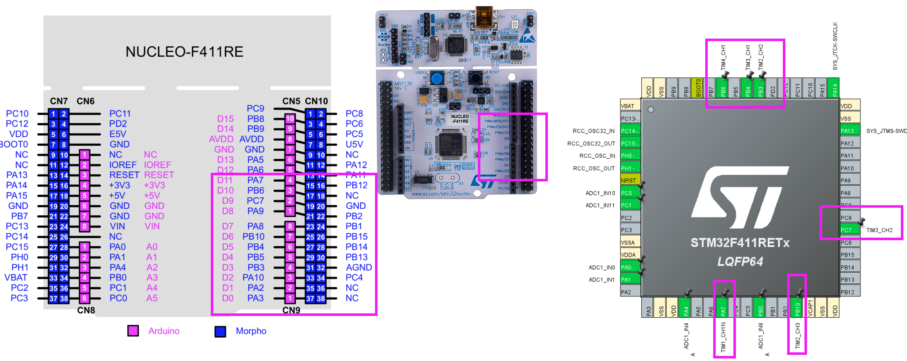
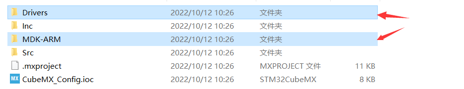
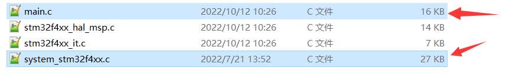
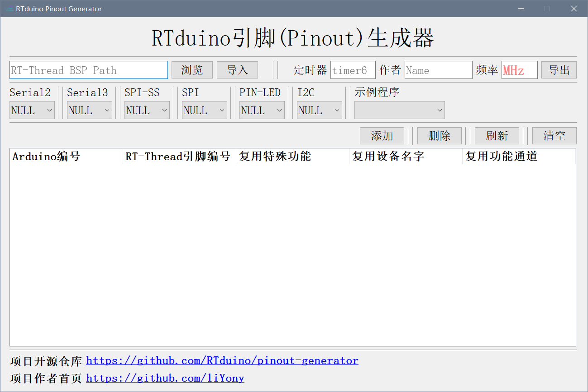
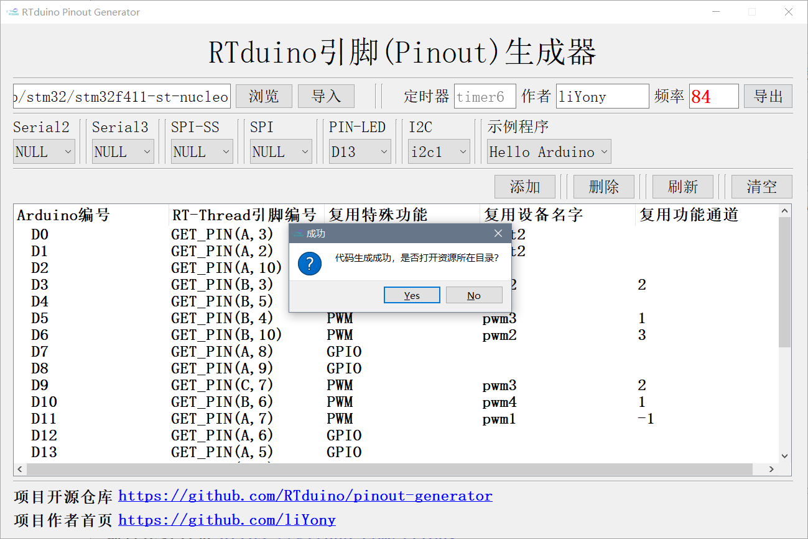
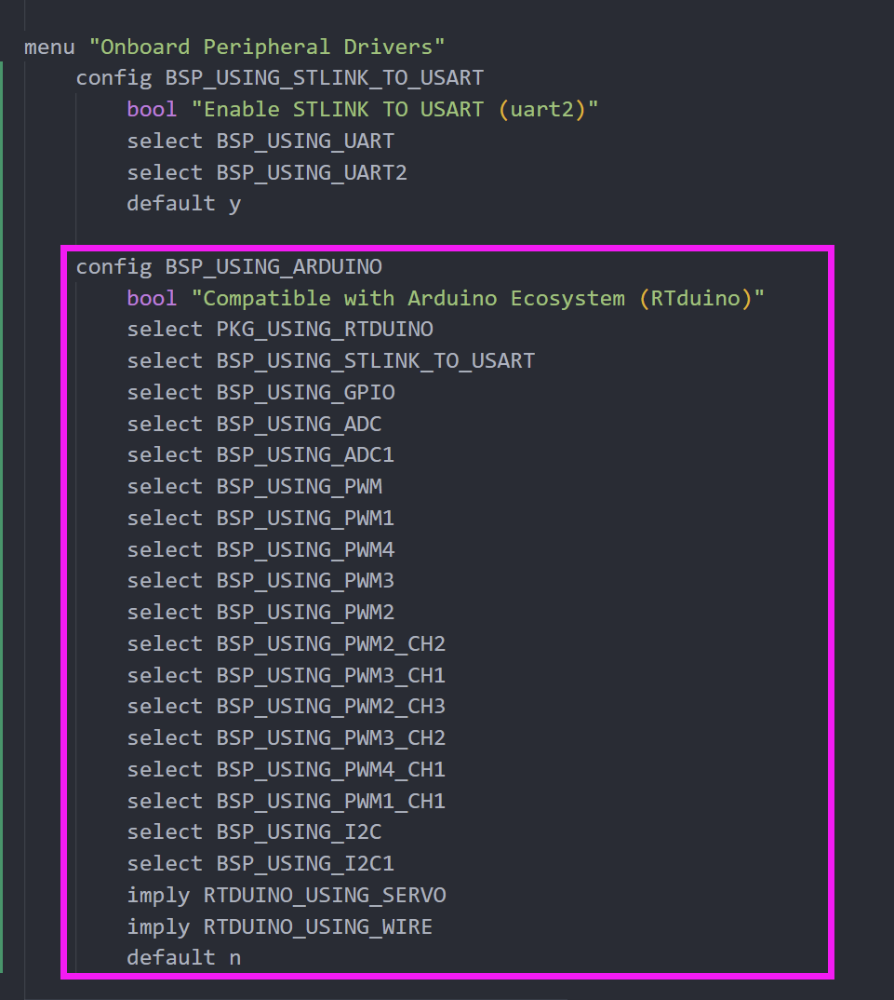

# RTduino STM32F411RE 对接

## 1、RTduino

[RTduino/RTduino: Arduino Ecosystem Compatibility Layer for RT-Thread | RT-Thread的Arduino生态兼容层 (github.com)](https://github.com/RTduino/RTduino)

## 2、STM32F411RE

[NUCLEO-F411RE - 采用STM32F411RE MCU的STM32 Nucleo-64开发板，支持Arduino和ST morpho连接 - STMicroelectronics](https://www.st.com/zh/evaluation-tools/nucleo-f411re.html)


## 3、如何对接

### 3.1、检查是否具有底层驱动

由于本次对接的是STM32系列的单片机，驱动文件是非常完善的，如下：



但是，如果大家对接的单片机是一些使用比较少的单片机，这些驱动文件或许并没有完全实现，大家可以自行实现或者去社区求助。



比如沁恒的BSP，目前就不支持PWM驱动。

### 3.2、CubeMX软件配置（STM32必须的，其他系列不一定）



#### ADC


#### PWM



#### UART


#### SPI

由于与PWM冲突，这里我们不对接SPI

#### I2C

RT-Thread使用的软件模拟I2C，所以我们可以直接使用GPIO框架。

#### 生成工程，删除多余代码



src里面：



### 3.3、编写Kconfig

#### On-chip Peripheral Drivers

UART

```shell
    menuconfig BSP_USING_UART
        bool "Enable UART"
        default n
        select RT_USING_SERIAL
        if BSP_USING_UART
            config BSP_USING_UART2
                bool "Enable UART2"
                default n

            config BSP_UART2_RX_USING_DMA
                bool "Enable UART2 RX DMA"
                depends on BSP_USING_UART2 && RT_SERIAL_USING_DMA
                default n
        endif
```

ADC

```shell
	menuconfig BSP_USING_ADC
        bool "Enable ADC"
        default n
        select RT_USING_ADC
        if BSP_USING_ADC
            config BSP_USING_ADC1
                bool "Enable ADC1"
                default n
        endif
```

PWM

```shell
	menuconfig BSP_USING_PWM
        bool "Enable PWM"
        default n
        select RT_USING_PWM

        if BSP_USING_PWM
            menuconfig BSP_USING_PWM1
                bool "Enable timer1 output PWM"
                default n
                if BSP_USING_PWM1
                    config BSP_USING_PWM1_CH1
                        bool "Enable PWM1 channel1"
                        default n
                endif

            menuconfig BSP_USING_PWM2
                bool "Enable timer2 output PWM"
                default n
                if BSP_USING_PWM2
                    config BSP_USING_PWM2_CH2
                        bool "Enable PWM2 channel2"
                        default n

                    config BSP_USING_PWM2_CH3
                        bool "Enable PWM2 channel3"
                        default n
                endif

            menuconfig BSP_USING_PWM3
                bool "Enable timer3 output PWM"
                default n
                if BSP_USING_PWM3
                    config BSP_USING_PWM3_CH1
                        bool "Enable PWM3 channel1"
                        default n

                    config BSP_USING_PWM3_CH2
                        bool "Enable PWM3 channel2"
                        default n
                endif
            
            menuconfig BSP_USING_PWM4
                bool "Enable timer4 output PWM"
                default n
                if BSP_USING_PWM4
                    config BSP_USING_PWM4_CH1
                        bool "Enable PWM4 channel1"
                        default n
                endif
        endif
```

I2C

```shell
	menuconfig BSP_USING_I2C
        bool "Enable I2C BUS"
        default n
        select RT_USING_I2C
        select RT_USING_I2C_BITOPS
        select RT_USING_PIN

        if BSP_USING_I2C
            config BSP_USING_I2C1
                bool "Enable I2C1 Bus (User I2C)"
                default n
                if BSP_USING_I2C1
                    comment "Notice: PB9 --> 25; PB8 --> 24" 
                    config BSP_I2C1_SCL_PIN
                        int "i2c1 SCL pin number"
                        range 1 176
                        default 24
                    config BSP_I2C1_SDA_PIN
                        int "i2c1 SDA pin number"
                        range 1 176
                        default 25
                endif
        endif
```

#### Onboard Peripheral Drivers

```
    config BSP_USING_STLINK_TO_USART
        bool "Enable STLINK TO USART (uart2)"
        select BSP_USING_UART
        select BSP_USING_UART2
        default y
```

剩下的东西可以使用一个软件来完成！

## 4、pinout-generator工具



填写完毕后，生成代码！




拷贝Kconfig(Please copy)文件内容到Board文件夹下的Kconfig。



然后就可以删除Kconfig(Please copy)文件了！

## 5、完善代码


## 6、编写README.md文件

参考其他已经适配RTduino的BSP编写。
[RTduino/RTduino: Arduino Ecosystem Compatibility Layer for RT-Thread | RT-Thread的Arduino生态兼容层 (github.com)](https://github.com/RTduino/RTduino#11-rt-thread-bsps-which-have-supported-rtduino)