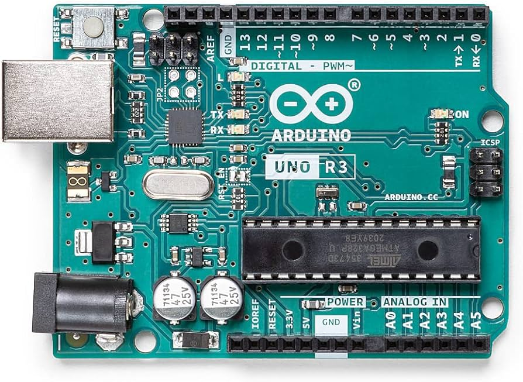

# 认识Arduino引脚布局

目前，各半导体厂商设计的评估板和开发板所支持的Arduino引脚插槽布局均遵循 **Arduino UNO 板**的引脚布局。因此， RTduino 也将 Arduino UNO 板引脚布局视为 Arduino 标准引脚布局。本章节将介绍 Arduino 标准引脚布局具体细节。

后续，文档中心将“Arduino UNO板引脚布局”**简称为**“Arduino 标准布局”。例如，STM32 Nulceo系列官方评估板使用的就含有的 **Arduino 标准布局**。

## 1 Arduino UNO板引脚布局

### 1.1 Arduino UNO板简介

Arduino UNO的历史可以追溯到Arduino项目的初始阶段，于2005年由一群意大利工程师和设计师共同创建。这个团队的目标是提供一个开源、易用的硬件平台，使非专业人士也能够轻松参与电子原型开发。由Massimo Banzi、David Cuartielles、Tom Igoe、Gianluca Martino和David Mellis等人共同推动，他们设计了一系列的原型板，其中最为知名的就是Arduino UNO。

Arduino UNO于2010年首次发布，采用了Atmel公司的ATmega328P微控制器作为其核心。这款微控制器提供了14个数字输入/输出引脚，其中包括6个可用作PWM输出，以及6个模拟输入引脚。UNO还配备了一个16 MHz的晶振、一个USB连接口、一个电源插座和一个复位按钮，使其成为一个功能齐全、易于使用的开发平台。

Arduino UNO的成功部分归功于其开放源代码的设计理念。其硬件和软件的全部设计文件都是公开的，使用户能够深入了解和修改设计，促进了创新和知识共享。这种开源精神吸引了全球广泛的社区参与，推动了Arduino生态系统的发展。

UNO板的使用范围非常广泛，它在学校、大学和各种教育机构中作为教学工具得到了广泛应用。由于其友好的开发环境和丰富的库，它也成为了创客和爱好者们在原型制作、DIY项目和艺术作品中的首选。其易用性和低成本使得任何对电子和编程感兴趣的人都能够轻松入门，从而推动了物联网、嵌入式系统等领域的普及。

随着时间的推移，Arduino项目逐步推出了其他型号的开发板，以满足不同需求，但Arduino UNO仍然是最为经典和受欢迎的型号之一。它不仅代表了Arduino项目的起源，更体现了开源硬件和软件在推动创新和教育中的重要作用。

### 1.1 Arduino UNO板引脚说明

Arduino UNO板上有多个引脚，这些引脚包括数字输入/输出引脚、模拟输入引脚、电源引脚等。以下是Arduino UNO板上主要引脚的说明：

1. **数字输入/输出引脚（Digital Pins）：**
   - 从D0到D15，总共14个数字输入/输出引脚。
   - D0和D1用于串口通信（TX和RX）。
   - D2和D3支持外部中断。
   - D3、D5、D6、D9、D10和D11支持脉冲宽度调制（PWM）输出。
   - D14、D15为I2C总线引脚。

2. **模拟输入引脚（Analog Pins）：**
   - A0到A5，总共6个模拟输入引脚。
   - 这些引脚可以用于读取模拟传感器的值，范围为0到1023。

3. **电源引脚：**
   - **5V引脚：** 提供5伏特的电源。
   - **3.3V引脚：** 提供3.3伏特的电源。
   - **GND引脚：** 地引脚，用于接地。
   - **Vin引脚：** 外部电源输入。

4. **其他重要引脚：**
   - **RESET引脚：** 用于复位Arduino。
   - **AREF引脚：** 模拟参考电压引脚，可用于设置模拟输入的参考电压。

5. **通信引脚：**
   - **TX（D1）和RX（D0）：** 用于串行通信，如与计算机或其他串口设备通信。

6. **ICSP引脚：**
   - **MISO，MOSI，SCK，RESET，VCC，GND：** 这些引脚是为了支持通过ICSP（In-Circuit Serial Programming）进行直接的微控制器编程。

7. **LED指示灯：**
   - 板上有一个连接到数字引脚13的LED，用于快速的测试和指示。
