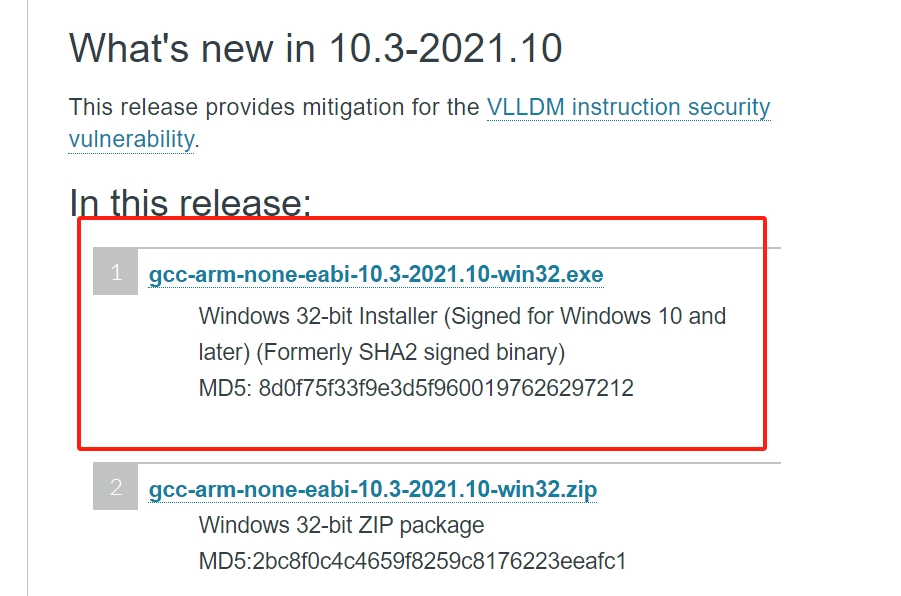

# RT-Thread Env 工具

Env 是 RT-Thread 推出的开发辅助工具，针对基于 RT-Thread 操作系统的项目工程，提供编译构建环境、图形化系统配置及软件包管理功能。

其内置的 menuconfig 图形化配置界面系统以及 scons 命令行系统，提供了简单易用的配置剪裁工具，可对内核、组件和软件包进行自由裁剪，使系统以搭积木的方式进行构建。

## 1 主要特性

- menuconfig 图形化配置界面，交互性好，操作逻辑强；
- 丰富的文字帮助说明，配置无需查阅文档；
- 使用灵活，自动处理依赖，功能开关彻底；
- 自动生成 rtconfig.h，无需手动修改；
- 使用 scons 工具生成工程，提供编译环境，操作简单；
- 提供多种软件包，模块化软件包耦合关联少，可维护性好；
- 软件包可在线下载，软件包持续集成，包可靠性高；

## 2 安装Env工具

<!-- tabs:start -->

## ** Windows 10安装Env **

对于Windows 10及以上的操作系统，可以直接利用其内置的Powershell终端作为平台。

### 2.1 下载与安装

需要以**管理员身份**运行 PowerShell 来执行如下三行命令即可自动下载并安装Env。

对于身在**中国大陆**的用户，请使用如下命令（使用[Gitee镜像源](https://gitee.com/RT-Thread-Mirror/env)下载）：

``` shell
wget https://gitee.com/RT-Thread-Mirror/env/raw/master/install_windows.ps1 -O install_windows.ps1
set-executionpolicy remotesigned
.\install_windows.ps1 --gitee
```

对于身在**中国大陆之外**的用户，请使用如下命令（使用[Github开发源](https://github.com/RT-Thread/env)下载）：

``` shell
wget https://raw.githubusercontent.com/RT-Thread/env/master/install_windows.ps1 -O install_windows.ps1
set-executionpolicy remotesigned
.\install_windows.ps1
```

### 2.2 环境变量设置

**以下操作仅需做一次**

#### 2.2.1 Env环境变量设置

打开 `C:\Users\user\Documents\WindowsPowerShell`，如果没有 `WindowsPowerShell` 则新建该文件夹。新建文件 `Microsoft.PowerShell_profile.ps1`，然后写入 `~/.env/env.ps1` 命令保存并重启 Powershell，`Microsoft.PowerShell_profile.ps1` 文件内的命令将会在每次启动 Powershell 终端时，均会自动初始化Env环境变量，无需手动初始化。

``` shell
~/.env/env.ps1
```

#### 2.2.2 编译工具链下载与环境变量设置

在Windows Powershell终端下默认不安装任何工具链，因此如果想要用 `scons` 命令直接编译，需要下载对应工具链，并将工具链所在路径添加到环境变量中。

这里以 `arm-none-eabi-gcc` 工具链为例，这个工具链是最常用的工具链，ARM架构平台（如STM32）普遍使用的工具链。我们[下载](https://developer.arm.com/downloads/-/gnu-rm)并安装工具链。



打开上一小节刚刚提到的 `Microsoft.PowerShell_profile.ps1` 文件，并附加工具链bin文件夹所在路径，例如：

``` shell
~/.env/env.ps1 # 上一小节已经添加过，无需再重复添加
$env:RTT_EXEC_PATH="C:\Program Files (x86)\GNU Arm Embedded Toolchain\10 2021.10\bin"
```

> 注：
> 
> 1. 开启VPN可能会影响clone，请关闭VPN；
> 2. Powershell 要以管理员身份打开；
> 3. 将其设置为 remotesigned 后，您可以作为普通用户运行 PowerShell；
> 4. 一定要关闭杀毒软件，否则安装过程可能会被杀毒软件强退。


## ** Windows 7安装Env **

Windows 7操作系统使用第三方终端ConEmu作为平台。RT-Thread基于ConEmu终端集成了所有Env功能，下载最新发布版本（.7z压缩包）并解压即可使用。

下载地址：https://github.com/RT-Thread/env-windows/releases

具体安装方法参见[RT-Thread文档中心](https://www.rt-thread.org/document/site/#/development-tools/env/env?id=env-%e7%9a%84%e4%bd%bf%e7%94%a8%e6%96%b9%e6%b3%95)。

> 注：
> 
> 1. Env-ConEmu 版本会内置QEMU以及 `arm-none-eabi-gcc`，编译ARM平台的BSP时可以直接 `scons` 编译。无需额外设置工具链的环境变量。


## ** Ubuntu安装Env **

对于Ubuntu操作系统，可以直接利用其内置的终端作为平台。

### 2.1 下载与安装

打开终端，并执行如下三行命令即可自动下载并安装Env。

对于身在**中国大陆**的用户，请使用如下命令（使用[Gitee镜像源](https://gitee.com/RT-Thread-Mirror/env)拉取）：

``` shell
wget https://gitee.com/RT-Thread-Mirror/env/raw/master/install_ubuntu.sh
chmod 777 install_ubuntu.sh
./install_ubuntu.sh --gitee
```

对于身在**中国大陆之外**的用户，请使用如下命令（使用[Github开发源](https://github.com/RT-Thread/env)拉取）：

``` shell
wget https://raw.githubusercontent.com/RT-Thread/env/master/install_ubuntu.sh
chmod 777 install_ubuntu.sh
./install_ubuntu.sh
```

### 2.2 环境变量设置

打开 `~/.bashrc` 文件，将 `source ~/.env/env.sh` 这行命令附加在改文件末尾，保存并退出。这样，每次启动终端时，均会自动初始化Env环境变量，无需手动初始化。

> 注：
> 
> 1. Ubuntu终端窗口下的Env在执行上述下载、安装命令时会自动安装 `arm-none-eabi-gcc` 工具链。但如需其他平台的工具链，需要用户手动安装。
> 2. 开启VPN可能会影响clone，请关闭VPN。

<!-- tabs:end -->

## 3 Env工具的使用

### 3.1 编译BSP

到RT-Thread 代码托管平台 [Github](https://github.com/RT-Thread/rt-thread) 或 [Gitee](https://gitee.com/rtthread/rt-thread) 下载源代码。

`git clone https://github.com/RT-Thread/rt-thread.git` （从Github平台克隆）

`git clone https://gitee.com/rtthread/rt-thread.git` （从Gitee平台克隆）

或者，直接从Github、Gitee的下载源码Zip包。

这里以 `stm32f411-st-nucleo` BSP、Windows 10操作系统环境为例，需要进入到 `rt-thread/bsp/stm32/stm32f411-st-nucleo` 文件夹下，按住Shift键+右键邮件，点击“在此处打开PowerShell窗口”。

#### 3.1.1 menuconfig -s 预设配置界面

如果这是你第一次使用Env，建议先键入命令 `menuconfig -s`，用于检查和设置软件包的下载行为：

``` Kconfig
Env config --->
    [*] Auto update pkgs config
        Select download server (Auto)  --->
    [ ] Auto create a Keil-MDK or IAR project
    [*] Send usage data for improve product
```

其中：

- `Auto update pkgs config`：退出 `menuconfig` 后是否自动下载选定的软件包，默认为选定。
- `Select download server`：选择下载软件包时的服务器，默认为根据IP或时区自动确定下载服务器，也可以手动选择使用Gitee或Github服务器下载软件包。
- `Auto create a Keil-MDK or IAR project`：退出 `menuconfig` 界面后是否自动生成Keil-MDK/IAR工程，默认不选定。RTduino不涉及，无需理会。
- `Send usage data for improve product`：向RT-Thread官方发送统计数据，用于RT-Thread统计软件包使用情况，默认为选定。

#### 3.1.2 menuconfig 配置界面

在PowerShell终端下，键入 `menuconfig` 命令，并进入到图形化配置界面中。

在 `menuconfig` 界面中，操作功能键如下：

- 上下方向键，或者数字区小键盘的加减按键用于控制上下功能的选择
- 空格键用于选定（使能）某个功能
- 回车键用于进入到子菜单
- ESC用于返回上一级或者连续按ESC可以退出，退出前会提示是否保存当前配置，一般选择Yes。
- 字母H键为帮助建，用于查看某个选项的详细信息

在 `menuconfig` 界面中，选择使能RTduino：

```Kconfig
Hardware Drivers Config --->
    Onboard Peripheral Drivers --->
        [*] Compatible with Arduino Ecosystem (RTduino)
```

选择 `Compatible with Arduino Ecosystem (RTduino)` 选项后，直接连续按ESC键保存并退出，Env会自动使能本BSP中RTduino所依赖的相关硬件（如I2C、PWM等），自动下载RTduino软件包并将其纳入到该BSP的RT-Thread工程中。

#### 3.1.3  scons 编译

在软件包均下载完毕之后，即可通过 `scons -j20` 命令来编译工程（20表示20个核心并行编译，数字根据电脑硬件实际情况填写）。也可以使用 `scons -j12 --exec-path='xxxx/bin'` 来指定本次编译所使用的的工具链（路径填写至工具链路径的bin文件路径下）。

编译出的 `.bin` 以及 `.elf` 文件即可烧入到板卡中。以STM32为例，则使用STM32CubeProgrammer软件将bin或elf文件烧入到板卡中。不同半导体厂商提供的烧录软件不一样，详情需要参考半导体厂商相关资料。


## 4 使用Env+VSCode创建工程

到[VSCode官网](https://code.visualstudio.com)下载VSCode并安装。

在RT-Thread 某个BSP板卡目录打开Env终端（例如PowerShell）使用 `scons --target=vsc` 生成VSCode工程


在Env终端（例如PowerShell）输入 `code .` 基于当前路径来打开VSCode工程。

可以在VSCode的终端内直接敲入 `menuconfig`、`scons` 等命令，与上述在PowerShell终端下的教程一致。

> 注意：
> 1. 在打开VSCode工程的时候，务必通过Env终端（例如PowerShell）去打开工程，因为RT-Thread的Env工具，会对系统的环境变量进行单独的配置，比如Env内部自带的python路径，编译工具链等一些重要环境变量，如果用户不使用此方式去打开VSCode工程，可能会因为环境变量缺失而引起一系列问题。
> 2. 在VSCode中使用menuconfig图形化界面时，上下方向键无效，需要使用数字小键盘区的加减号键代替。
> 3. 在执行完 `menuconfig` 重新配置之后，需要执行 `scons --target=vsc` 重新更新一下VSCode工程文件。
