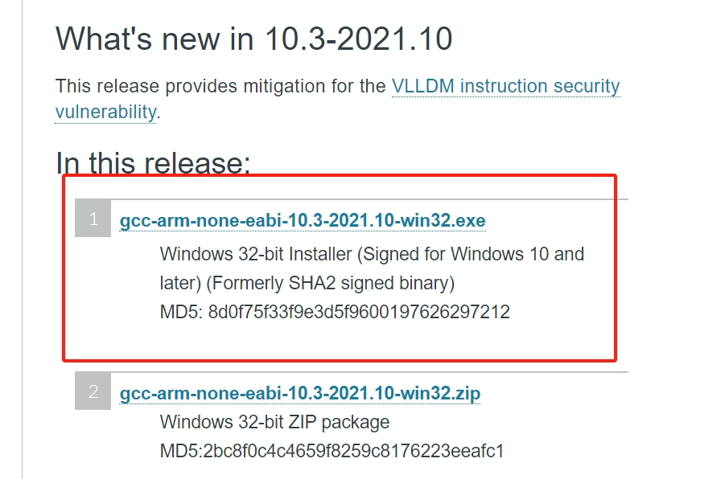
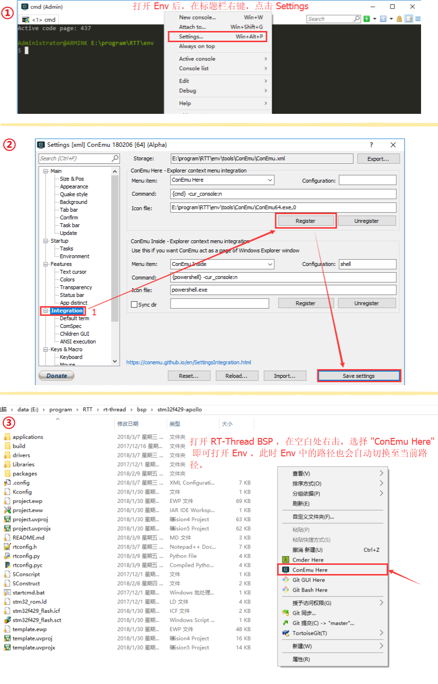
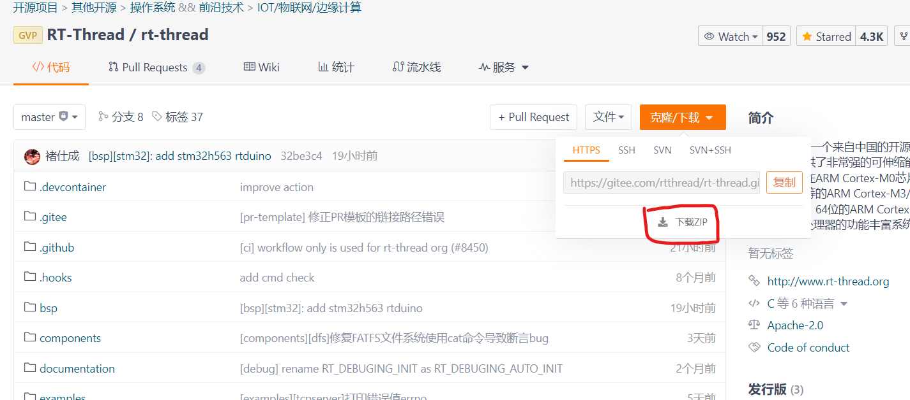
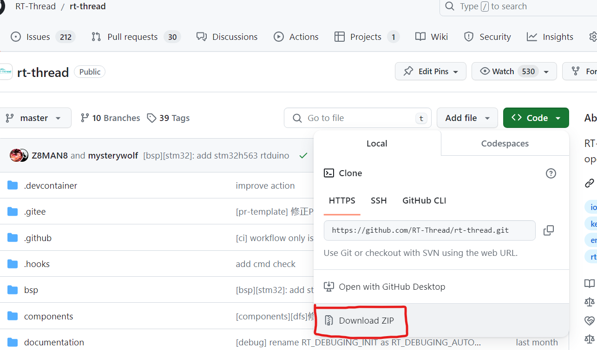
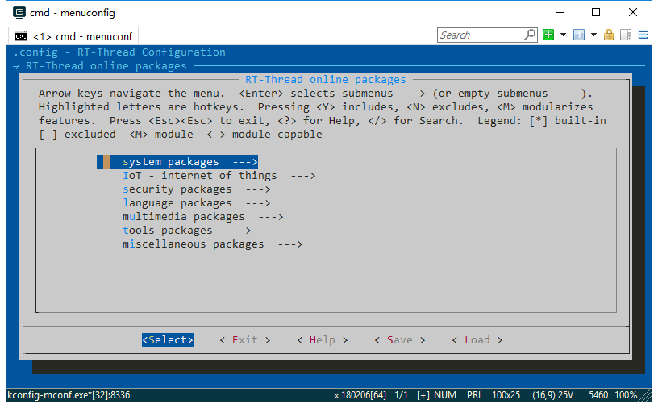

# Env编译环境搭建

## 1 RT-Thread Env 工具简介

Env 是 RT-Thread 推出的开发辅助工具，针对基于 RT-Thread 操作系统的项目工程，提供编译构建环境、图形化系统配置及软件包管理功能。

其内置的 menuconfig 图形化配置界面系统以及 scons 命令行系统，提供了简单易用的配置剪裁工具，可对内核、组件和软件包进行自由裁剪，使系统以搭积木的方式进行构建。其主要特点为：

- menuconfig 图形化配置界面，交互性好，操作逻辑强；
- 丰富的文字帮助说明，配置无需查阅文档；
- 使用灵活，自动处理依赖，功能开关彻底；
- 自动生成 rtconfig.h，无需手动修改；
- 使用 scons 工具生成工程，提供编译环境，操作简单；
- 提供多种软件包，模块化软件包耦合关联少，可维护性好；
- 软件包可在线下载，软件包持续集成，包可靠性高；

## 2 安装Env工具

<!-- tabs:start -->

## ** Windows 10 **

### 2.1 下载与安装

对于Windows 10及以上的操作系统，可以直接利用其内置的Powershell终端作为平台。需要以**管理员身份**运行 PowerShell 来执行如下三行命令即可自动下载并安装Env。

对于身在**中国大陆**的用户，请使用如下命令（使用[Gitee镜像源](https://gitee.com/RT-Thread-Mirror/env)下载）：

``` shell
wget https://gitee.com/RT-Thread-Mirror/env/raw/master/install_windows.ps1 -O install_windows.ps1
set-executionpolicy remotesigned
.\install_windows.ps1 --gitee
```

对于身在**中国大陆之外**的用户，请使用如下命令（使用[GitHub开发源](https://github.com/RT-Thread/env)下载）：

``` shell
wget https://raw.githubusercontent.com/RT-Thread/env/master/install_windows.ps1 -O install_windows.ps1
set-executionpolicy remotesigned
.\install_windows.ps1
```

### 2.2 环境变量设置

#### 2.2.1 Env环境变量设置

打开 `C:\Users\user\Documents\WindowsPowerShell`，如果没有`WindowsPowerShell`则新建该文件夹。新建文件 `Microsoft.PowerShell_profile.ps1`，然后写入 `~/.env/env.ps1` 命令保存并重启 Powershell，`Microsoft.PowerShell_profile.ps1` 文件内的命令将会在每次启动 Powershell 终端时，均会自动初始化Env环境变量，无需手动初始化。

``` shell
~/.env/env.ps1
```

#### 2.2.2 编译工具链下载与环境变量设置

在Windows Powershell终端下默认不安装任何工具链，因此如果想要用 `scons` 命令直接编译，需要下载对应工具链，并将工具链所在路径添加到环境变量中。

这里以 `arm-none-eabi-gcc` 工具链为例，这个工具链是最常用的工具链，ARM架构平台（如STM32）普遍使用的工具链。我们[下载](https://developer.arm.com/downloads/-/gnu-rm)并安装工具链。



打开上一小节刚刚提到的 `Microsoft.PowerShell_profile.ps1` 文件，并附加工具链bin文件夹所在路径，例如：

``` shell
~/.env/env.ps1 # 上一小节已经添加过，无需再重复添加
$env:RTT_EXEC_PATH="C:\Program Files (x86)\GNU Arm Embedded Toolchain\10 2021.10\bin"
```

> ⚠️注意：
> 
> 1. 开启VPN可能会影响clone，请关闭VPN；
> 2. 一定要关闭杀毒软件，否则安装过程可能会被杀毒软件强退。


## ** Windows 7 **

### 2.1 下载与安装

Windows 7操作系统使用第三方终端ConEmu作为平台。RT-Thread基于ConEmu终端集成了所有Env功能，[下载](https://github.com/RT-Thread/env-windows/releases)最新发布版本（.7z压缩包）并解压即可使用。

进入解压文件夹的目录，可以运行本目录下的 `env.exe`，如果打开失败可以尝试使用 `env.bat`。

根据如下步骤操作，就可以在任意文件夹下通过右键菜单来启动 Env 控制台：



> ⚠️注意：
> 
> 1. Env-ConEmu 版本会内置QEMU以及 `arm-none-eabi-gcc`，编译ARM平台的BSP时可以直接 `scons` 编译。无需额外设置工具链的环境变量。
> 2. 因为需要设置 Env 进程的环境变量，第一次启动可能会出现杀毒软件误报的情况，如果遇到了杀毒软件误报，请允许 Env 相关程序运行，然后将相关程序添加至白名单即可。


## ** Ubuntu **

### 2.1 下载与安装

对于Ubuntu操作系统，可以直接利用其内置的终端作为平台。打开终端，并执行如下三行命令即可自动下载并安装Env。

对于身在**中国大陆**的用户，请使用如下命令（使用[Gitee镜像源](https://gitee.com/RT-Thread-Mirror/env)拉取）：

``` shell
wget https://gitee.com/RT-Thread-Mirror/env/raw/master/install_ubuntu.sh
chmod 777 install_ubuntu.sh
./install_ubuntu.sh --gitee
```

对于身在**中国大陆之外**的用户，请使用如下命令（使用[GitHub开发源](https://github.com/RT-Thread/env)拉取）：

``` shell
wget https://raw.githubusercontent.com/RT-Thread/env/master/install_ubuntu.sh
chmod 777 install_ubuntu.sh
./install_ubuntu.sh
```

### 2.2 环境变量设置

打开 `~/.bashrc` 文件，将 `source ~/.env/env.sh` 这行命令附加在改文件末尾，保存并退出。这样，每次启动终端时，均会自动初始化Env环境变量，无需手动初始化。

> ⚠️注意：
> 
> 1. Ubuntu终端窗口下的Env在执行上述下载、安装命令时会自动安装 `arm-none-eabi-gcc` 工具链。但如需其他平台的工具链，需要用户手动安装。
> 2. 开启VPN可能会影响clone，请关闭VPN。

<!-- tabs:end -->

## 3 Env工具的使用

### 3.1 下载RT-Thread代码

<!-- tabs:start -->

## ** Gitee **

如果您身在中国大陆，请选择Gitee代码托管平台。

#### 3.1.1 方法1 - 直接下载RT-Thread zip源码压缩包

仓库地址：https://gitee.com/rtthread/rt-thread



#### 3.1.2 方法2 - clone RT-Thread仓库代码

``` bash
git clone https://gitee.com/rtthread/rt-thread.git
```

## ** GitHub **

如果您身在中国大陆之外，请选择GitHub代码托管平台。

#### 3.1.1 方法1 - 直接下载RT-Thread zip源码压缩包

仓库地址：https://github.com/RT-Thread/rt-thread



#### 3.1.2 方法2 - clone RT-Thread仓库代码

``` bash
git clone https://github.com/RT-Thread/rt-thread.git
```

<!-- tabs:end -->

### 3.2 基本命令与编译BSP

这里以 `stm32f411-st-nucleo` BSP、Windows 10操作系统环境为例，需要进入到 `rt-thread/bsp/stm32/stm32f411-st-nucleo` 文件夹下，按住Shift键+单击鼠标右键，点击**在此处打开PowerShell窗口**。

#### 3.2.1 menuconfig -s 预设配置界面

⚠️**本节内容仅需操作一次，无需每次都操作一遍**

如果这是你第一次使用Env，请先键入命令 `menuconfig -s`，用于检查和设置软件包的下载行为，这些设置只需要设置一次即可。

``` Kconfig
Env config --->
    [*] Auto update pkgs config
        Select download server (Auto)  --->
    [ ] Auto create a Keil-MDK or IAR project
    [*] Send usage data for improve product
```

其中：

- `Auto update pkgs config`：退出 menuconfig 后是否自动下载选定的软件包，默认为选定。
- `Select download server`：选择下载软件包时的服务器，默认为根据IP或时区自动确定下载服务器，也可以手动选择使用Gitee或GitHub服务器下载软件包。
- `Auto create a Keil-MDK or IAR project`：退出 menuconfig 界面后是否自动生成Keil-MDK/IAR工程，默认不选定。RTduino不涉及，无需理会。
- `Send usage data for improve product`：向RT-Thread官方发送统计数据，用于RT-Thread统计软件包使用情况，默认为选定。

#### 3.2.2 menuconfig 配置界面

在PowerShell终端下，键入 `menuconfig` 命令，并进入到图形化配置界面中。

在 menuconfig 界面中，操作功能键如下：

- 上下方向键，或者数字区小键盘的加减按键用于控制上下功能的选择
- 空格键用于选定（使能）某个功能
- 回车键用于进入到子菜单
- ESC用于返回上一级或者连续按ESC可以退出，退出前会提示是否保存当前配置，一般选择Yes。
- 字母H键为帮助建，用于查看某个选项的详细信息

在 menuconfig 界面中，选择使能RTduino：

```Kconfig
Hardware Drivers Config --->
    Onboard Peripheral Drivers --->
        [*] Compatible with Arduino Ecosystem (RTduino)
```

选择 `Compatible with Arduino Ecosystem (RTduino)` 选项后，直接连续按ESC键保存并退出，Env会自动使能本BSP中RTduino所依赖的相关硬件（如I2C、PWM等），自动下载RTduino软件包并将其纳入到该BSP的RT-Thread工程中。

#### 3.2.3  scons 编译BSP

在软件包均下载完毕之后，即可通过 `scons -j20` 命令来编译工程（20表示20个核心并行编译，数字根据电脑硬件实际情况填写）。

也可以使用 `scons -j12 --exec-path="xxxx/bin"` 来指定本次编译所使用的的工具链（路径填写至工具链路径的bin文件路径下，注意路径最好用双引号括起来，例如 `scons -j12 --exec-path="C:\Program Files (x86)\GNU Arm Embedded Toolchain\10 2021.10\bin"`）。

编译出的 `.bin` 以及 `.elf` 文件即可烧入到板卡中。以STM32为例，则使用STM32CubeProgrammer软件将bin或elf文件烧入到板卡中。不同半导体厂商提供的烧录软件不一样，详情需要参考半导体厂商相关资料。后文会详细介绍。

### 3.3 RT-Thread 软件包管理

**⚠️本节内容为进阶知识，如果您是初学者，则无需阅读本节内容。**

RT-Thread 提供一个软件包管理平台，这里存放了官方提供或开发者提供的软件包。该平台为开发者提供了众多可重用软件包的选择，这也是 RT-Thread 生态的重要组成部分。

[RTduino—Arduino 生态兼容层软件包](https://packages.rt-thread.org/detail.html?package=RTduino)本身以及[大量 RTduino、Arduino 库](https://packages.rt-thread.org/search.html?search=Arduino)都已近被注册到 [RT-Thread 软件包中心](https://packages.rt-thread.org/)。

#### 3.3.1 pkgs 命令简介

`pkgs` 命令为开发者提供了软件包的下载、更新、删除等管理功能。

Env 命令行输入 `pkgs -h` 可以看到命令简介：

```shell
usage: env.py package [-h] [--update] [--update-force] [--list] [--wizard]
                      [--upgrade] [--upgrade-force] [--upgrade-script-force]
                      [--upgrade-modules] [--printenv]

optional arguments:
  -h, --help            show this help message and exit
  --update              update packages, install or remove the packages by
                        your settings in menuconfig
  --update-force, --force-update
                        forcely update and clean packages, install or remove
                        packages by settings in menuconfig
  --list                list target packages
  --wizard              create a new package with wizard
  --upgrade             upgrade local packages index from git repository
  --upgrade-force, --force-upgrade
                        forcely upgrade local packages index from git
                        repository
  --upgrade-script-force
                        forcely upgrade local packages index and Env script
                        from git repository
  --upgrade-modules     upgrade python modules, e.g. requests module
  --printenv            print environmental variables to check
```

#### 3.3.2 下载、更新、删除软件包

在下载、更新软件包前，需要先在 menuconfig 中 **开启** 你想要操作的软件包

这些软件包位于 `RT-Thread online packages` 菜单下，进入该菜单后，则可以看如下软件包分类：



找到你需要的软件包然后选中开启，保存并退出 menuconfig 。此时软件包已被标记选中，但是还没有下载到本地，所以还无法使用。

- **下载** ：如果软件包在本地已被选中，但是未下载，此时输入：`pkgs --update` ，该软件包自动下载；
- **自动下载** ：如果执行过`menuconfig -s` 命令并选中了 `Auto update pkgs config` 选项，则在 menuconfig 界面退出时自动执行 `pkgs --update`命令并下载选中和依赖的软件包；
- **更新** ：如果选中的软件包在服务器端有更新，并且版本号选择的是 **latest** 。此时输入： `pkgs --update` ，该软件包将会在本地进行更新；
- **删除** ：某个软件包如果无需使用，需要先在 menuconfig 中取消其的选中状态，然后再执行： `pkgs --update` 。此时本地已下载但未被选中的软件包将会被删除。

下载软件包时，Env工具会根据IP地址和所在时区，自动判定并使用最佳镜像源，以确保用户下载速度流畅。

#### 3.3.3 升级本地软件包信息命令

由于会有越来越多的软件包加入，所以本地看到 menuconfig 中的软件包列表可能会与服务器 **不同步** 。使用升级本地软件包信息命令即可解决该问题，这个命令不仅会对本地的包信息进行更新同步，还会对 Env 的功能脚本进行升级，建议定期使用。其中：

- `pkgs --upgrade` 是正常升级本地软件包列表，如果用户修改本地软件包列表，有可能因发生冲突而导致升级失败；
- `pkgs --upgrade-force` 是强制升级本地软件包列表，如果用户修改本地软件包列表，在升级时会强行将用户自行修改的内容删除，并保持和服务器列表同步（**推荐**）；
- `pkgs --upgrade-script-force` 不但会强制同步服务器软件包列表，并且会升级Env工具自身的脚本，一般不会用到。

升级本地软件包信息时，Env工具会根据IP地址和所在时区，自动判定并使用最佳镜像源，以确保用户升级速度流畅。
