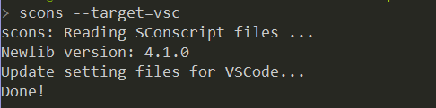

# Env工具的使用

## 编译BSP

到RT-Thread 代码托管平台 [Github](https://github.com/RT-Thread/rt-thread) 或 [Gitee](https://gitee.com/rtthread/rt-thread) 下载源代码。

这里以`stm32f411-st-nucleo`这个BSP、Windows 10操作系统环境为例，需要进入到 `rt-thread\bsp\stm32\stm32f411-st-nucleo` 文件夹下，按住Shift键+右键邮件，点击“在此处打开PowerShell窗口”。

### menuconfig -s 预设配置界面

如果这是你第一次使用Env，建议先键入命令 `menuconfig -s`，用于检查和设置软件包的下载行为：

``` Kconfig
Env config --->
    [*] Auto update pkgs config
        Select download server (Auto)  --->
    [ ] Auto create a Keil-MDK or IAR project
    [*] Send usage data for improve product
```

其中：

- `Auto update pkgs config`：退出 `menuconfig` 后是否自动下载选定的软件包，默认为选定。
- `Select download server`：选择下载软件包时的服务器，默认为根据IP或时区自动确定下载服务器，也可以手动选择使用Gitee或Github服务器下载软件包。
- `Auto create a Keil-MDK or IAR project`：退出 `menuconfig` 界面后是否自动生成Keil-MDK/IAR工程，默认不选定。RTduino不涉及，无需理会。
- `Send usage data for improve product`：向RT-Thread官方发送统计数据，用于RT-Thread统计软件包使用情况，默认为选定。

### menuconfig 配置界面

在PowerShell终端下，键入 `menuconfig` 命令，并进入到图形化配置界面中。

在 `menuconfig` 界面中，操作功能键如下：

- 上下方向键，或者数字区小键盘的加减按键用于控制上下功能的选择
- 空格键用于选定（使能）某个功能
- 回车键用于进入到子菜单
- ESC用于返回上一级或者连续按ESC可以退出，退出前会提示是否保存当前配置，一般选择Yes。
- 字母H键为帮助建，用于查看某个选项的详细信息

在 `menuconfig` 界面中，选择使能RTduino：

```Kconfig
Hardware Drivers Config --->
    Onboard Peripheral Drivers --->
        [*] Compatible with Arduino Ecosystem (RTduino)
```

选择 `Compatible with Arduino Ecosystem (RTduino)` 选项后，直接连续按ESC键保存并退出，Env会自动使能本BSP中RTduino所依赖的相关硬件（如I2C、PWM等），自动下载RTduino软件包并将其纳入到该BSP的RT-Thread工程中。

### scons 编译

在软件包均下载完毕之后，即可通过 `scons -j20` 命令来编译工程（20表示20个核心并行编译，数字根据电脑硬件实际情况填写）。也可以使用 `scons -j12 --exec-path='xxxx/bin'` 来指定本次编译所使用的的工具链（路径填写至工具链路径的bin文件路径下）。

编译出的 `.bin` 以及 `.elf` 文件即可烧入到板卡中。以STM32为例，则使用STM32CubeProgrammer软件将bin或elf文件烧入到板卡中。不同半导体厂商提供的烧录软件不一样，详情需要参考半导体厂商相关资料。


## 使用Env+VSCode创建工程

到[VSCode官网](https://code.visualstudio.com)下载VSCode并安装。

在RT-Thread 某个BSP板卡目录打开Env终端（例如PowerShell）使用 `scons --target=vsc` 生成VSCode工程



在Env终端（例如PowerShell）输入 `code .` 基于当前路径来打开VSCode工程。

可以在VSCode的终端内直接敲入 `menuconfig`、`scons` 等命令，与上述在PowerShell终端下的教程一致。

> 注意：
> 1. 在打开VSCode工程的时候，务必通过Env终端（例如PowerShell）去打开工程，因为RT-Thread的Env工具，会对系统的环境变量进行单独的配置，比如Env内部自带的python路径，编译工具链等一些重要环境变量，如果用户不使用此方式去打开VSCode工程，可能会因为环境变量缺失而引起一系列问题。
> 2. 在VSCode中使用menuconfig图形化界面时，上下方向键无效，需要使用数字小键盘区的加减号键代替。
> 3. 在执行完 `menuconfig` 重新配置之后，需要执行 `scons --target=vsc` 重新更新一下VSCode工程文件。
