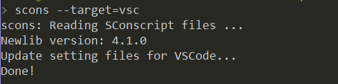

# 使用Env+VSCode创建工程

## 环境搭建

到[VSCode官网](https://code.visualstudio.com)下载VSCode并安装。

## 生成VSCode工程

在RT-Thread BSP 目录打开Env终端使用 `scons --target=vsc` 生成VSCode工程

在ENV终端输入 `code .` 基于当前路径来打开VSCode工程。

> 注意：在打开VSCode工程的时候，务必通过Env终端去打开工程，因为RT-Thread的Env工具，会对系统的环境变量进行单独的配置，比如ENV内部自带的python路径，编译工具链等一些重要环境变量，如果用户不使用此方式去打开VsCode工程，可能会因为环境变量缺失而引起一系列问题。

## 编译与烧录

1. 可以在 VSCode 终端中使用 `scons -j20` 编译工程（20为20个CPU核心并行编译，数字根据电脑实际硬件情况选择）。
2. 编译出的 `.bin` 或 `.elf` 文件即可烧入到板卡中。以STM32为例，则使用STM32CubeProgrammer软件将bin或elf文件烧入到板卡中。不同半导体厂商提供的烧录软件不一样，详情需要参考半导体厂商相关资料。

