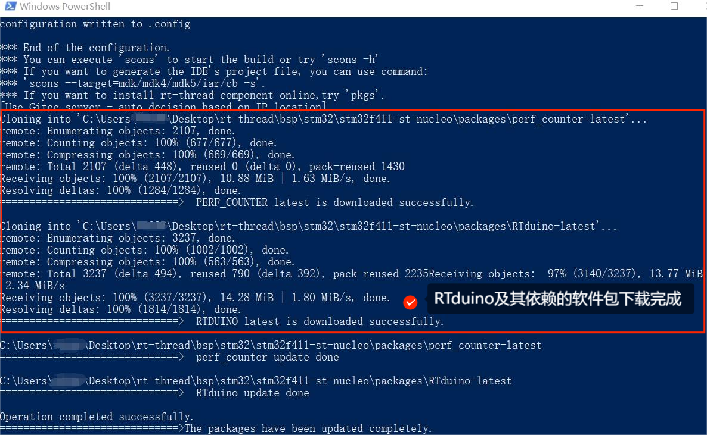
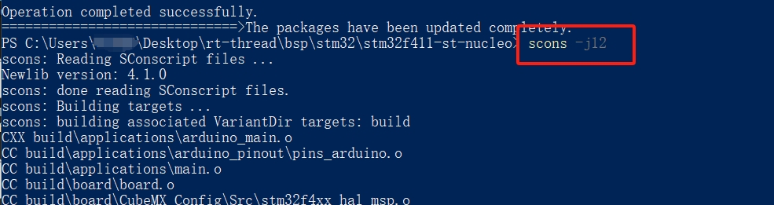
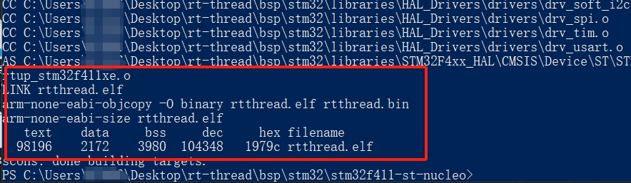
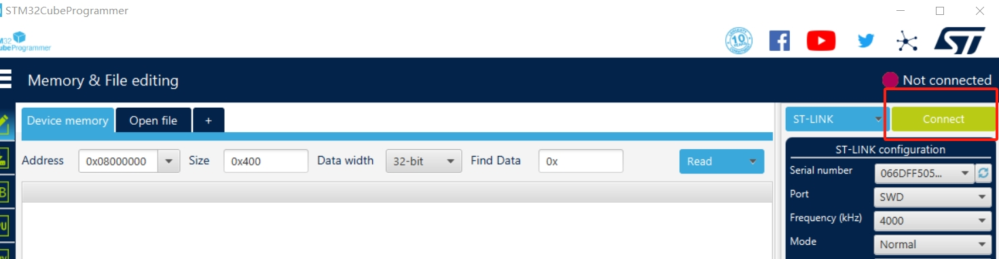
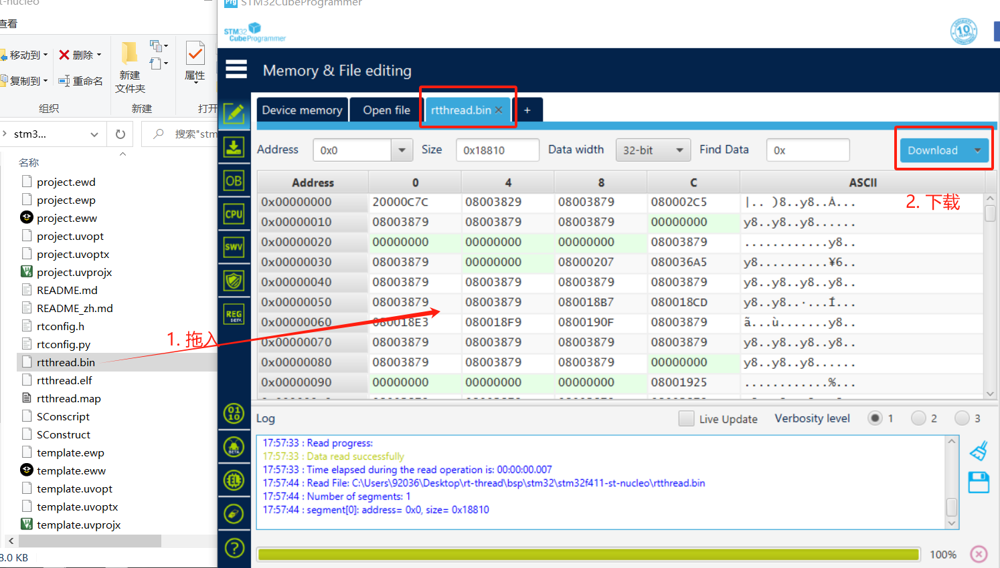

# 向板卡烧录程序

## 1 前章小结

通过前面几章的介绍，大家已经对如下内容有了一个大致的了解：
- 什么是RTduino/RT-Thread；
- 如何下载RT-Thread源码
- 如何搭建RTduino/RT-Thread编译环境，以及如何编辑代码；
- 什么是Env工具
- 如何使能并编译RTduino

## 2 如何编译BSP并将程序烧录到板卡

本小节将带着大家把整个编译、下载流程梳理一遍，假设您已经搭建好Env编译环境，并下载好RT-Thread源码。

<!-- tabs:start -->

## ** STM32 Nucleo (Windows 10) **

这里以 `stm32f411-st-nucleo` BSP、Windows 10操作系统环境为例，需要进入到 `rt-thread/bsp/stm32/stm32f411-st-nucleo` 文件夹下，按住Shift键+单击鼠标右键，点击**在此处打开PowerShell窗口**。

### 2.1 使能RTduino

在 menuconfig 界面中，选择使能RTduino：

```Kconfig
Hardware Drivers Config --->
    Onboard Peripheral Drivers --->
        [*] Compatible with Arduino Ecosystem (RTduino)
```

连续按ESC键，保存(Yes)并退出，此时Env工具会自动下载所需的软件包：



> ⚠️注意：
>
> 1. 如果没有自动下载依赖的软件包，可以通过命令 `menuconfig -s`，选中 `Auto update pkgs config` （该操作只需要执行一次）。并重新进一次 `menuconfig` 并退出，即可自动下载所依赖的软件包。
>
> ``` Kconfig
> Env config --->
>     [*] Auto update pkgs config
>         Select download server (Auto)  --->
>     [ ] Auto create a Keil-MDK or IAR project
>     [ ] Send usage data for improve product
> ```
>
> 2. 下载依赖软件包时，如果出现下载失败的问题，请检查是否开启了VPN，VPN会干扰软件包下载，请关闭VPN。


### 2.2 编译BSP

在软件包均下载完毕之后，即可通过 `scons -j20` 命令来编译工程（20表示20个核心并行编译，数字根据电脑硬件实际情况填写）。





编译后，会在 `stm32f411-st-nucleo` 文件夹下生成 `rtthread.bin` 文件，该文件即为要烧入到板卡的二进制文件。

### 2.3 将bin文件烧录到板卡

下载[STM32CubeProgrammer](https://www.stmcu.com.cn/ecosystem/Cube/STM32CubeProg)软件，该软件用于将bin文件下载到STM32板卡中。[下载地址](https://www.stmcu.com.cn/Designresource/detail/software/709549)。

安装后，将STM32 F411 Nucleo板通过USB线插到计算机上。

打开STM32CubeProgrammer软件并点击**Connect按钮**：



将bin文件**拖入**到STM32CubeProgrammer界面内并点击**Download按钮**，即可完成程序烧录：



至此，你的RTduino程序就在板卡上运行起来了！

## ** Raspberry Pi Pico (Ubuntu)**

<!-- tabs:end -->
