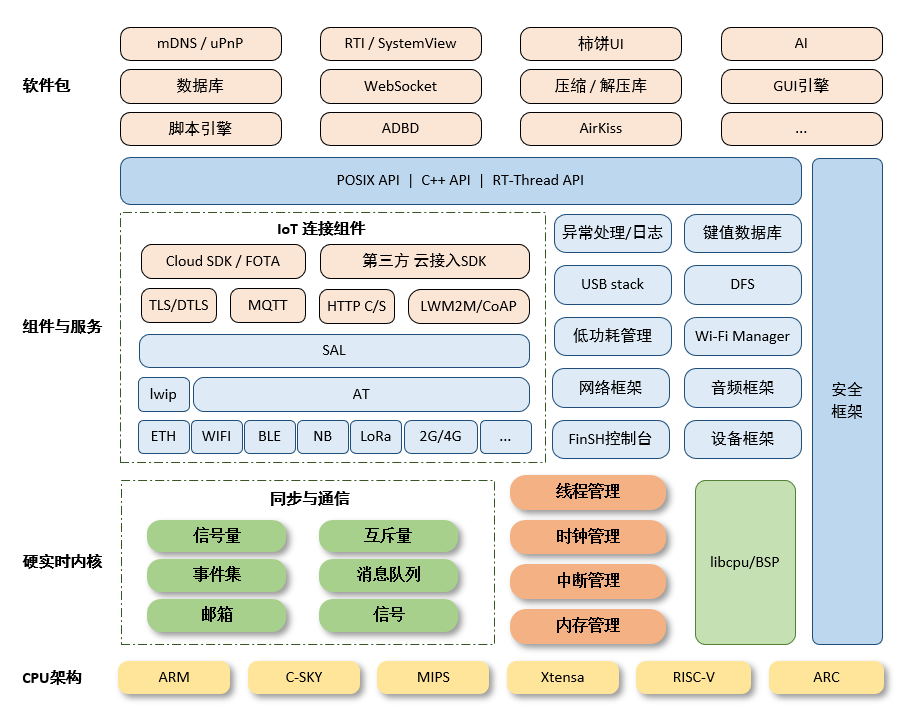

# RT-Thread

## 1 简介

RT-Thread诞生于2006年，是一款以开源、中立、社区化发展起来的实时操作系统。RT-Thread主要采用 C 语言编写，浅显易懂，且具有方便移植的特性（可快速移植到多种主流 MCU 及模组芯片上）。RT-Thread把面向对象的设计方法应用到实时系统设计中，使得代码风格优雅、架构清晰、系统模块化并且可裁剪性非常好。

通过RT-Thread在线的软件包管理工具，配合系统配置工具实现直观快速的模块化裁剪，并且可以无缝地导入丰富的软件功能包。RTduino便是其中一个软件包，通过RTduino软件包的加持，可以使运行RT-Thread实时操作系统的板卡轻松运行Arduino的各种库和代码。

## 2 RT-Thread架构

RT-Thread是一个集实时操作系统（RTOS）内核、中间件组件的物联网操作系统，架构如下：

- 内核层：RT-Thread内核，是 RT-Thread的核心部分，包括了内核系统中对象的实现，例如多线程及其调度、信号量、邮箱、消息队列、内存管理、定时器等；libcpu/BSP（芯片移植相关文件 / 板级支持包）与硬件密切相关，由外设驱动和 CPU 移植构成。

- 组件与服务层：组件是基于 RT-Thread内核之上的上层软件，例如虚拟文件系统、FinSH命令行界面、网络框架、设备框架等。采用模块化设计，做到组件内部高内聚，组件之间低耦合。

- RT-Thread软件包：运行于 RT-Thread物联网操作系统平台上，面向不同应用领域的通用软件组件，由描述信息、源代码或库文件组成。RT-Thread提供了开放的软件包平台，这里存放了官方提供或开发者提供的软件包，该平台为开发者提供了众多可重用软件包的选择，这也是 RT-Thread生态的重要组成部分。软件包生态对于一个操作系统的选择至关重要，因为这些软件包具有很强的可重用性，模块化程度很高，极大的方便应用开发者在最短时间内，打造出自己想要的系统。RT-Thread已经支持的软件包数量已经达到450+。

## 3 RT-Thread的特点

- 资源占用极低，超低功耗设计，最小内核（Nano版本）仅需1.2KB RAM，3KB Flash。
- 组件丰富，繁荣发展的软件包生态 。
- 简单易用 ，优雅的代码风格，易于阅读、掌握。
- 高度可伸缩，优质的可伸缩的软件架构，松耦合，模块化，易于裁剪和扩展。
- 强大，支持高性能应用。
- 跨平台、芯片支持广泛。

## 4 官网与代码仓库

- Github代码仓库: https://github.com/RT-Thread/rt-thread
- Gitee代码仓库: https://gitee.com/rtthread/rt-thread
- RT-Thread官网: https://www.rt-thread.org/
- RT-Thread文档中心: https://www.rt-thread.org/document/site/#/
- RT-Thread文档中心仓库: https://gitee.com/rtthread/docs-online/
