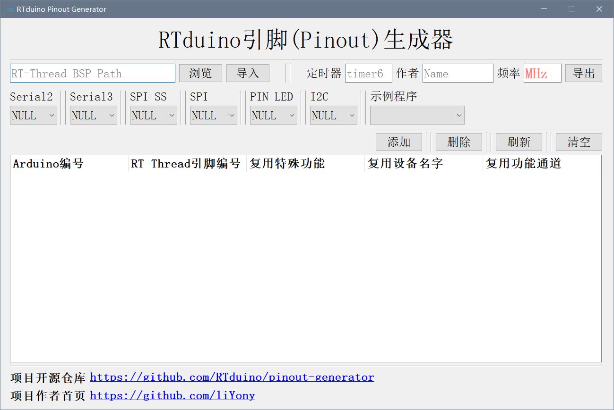
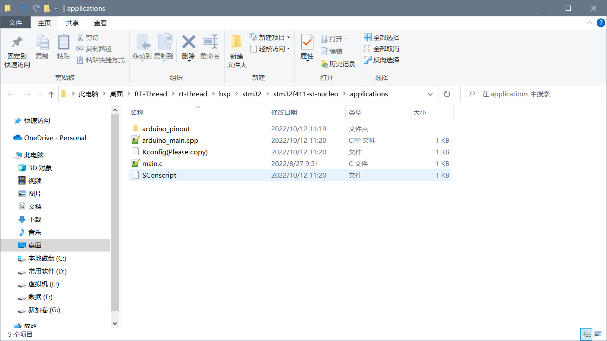
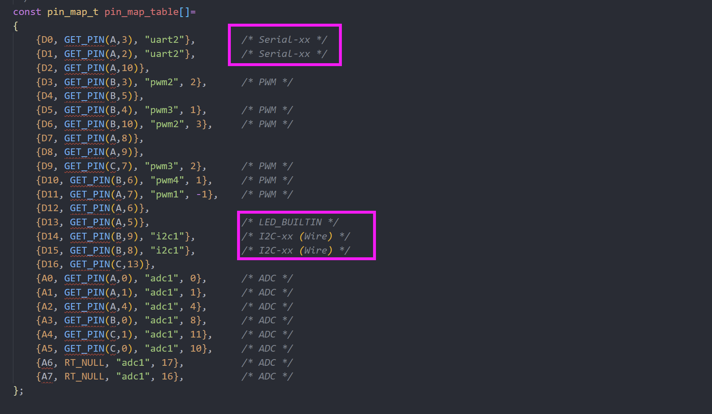

# STM32 BSP适配RTduino

我们以 [STM32F411RE Nucleo-64开发板](https://github.com/RT-Thread/rt-thread/tree/master/bsp/stm32/stm32f411-st-nucleo/applications/arduino_pinout) 为例进行对接。

配套视频教程：[RTduino对接到RT-Thread BSP手把手教程（视频）](https://www.bilibili.com/video/BV1WG41177Cu)

## 1 检查是否具有底层驱动

由于本次对接的是STM32系列的单片机，驱动文件是非常完善的，如下：


但是，如果大家对接的单片机是一些使用比较少的单片机，这些驱动文件或许并没有完全实现，大家可以自行实现或者去社区求助。

## 2 CubeMX软件配置（STM32必须的，其他系列不一定）


### 2.1 ADC


### 2.2 PWM


STM32对接PWM教程：https://www.rt-thread.org/document/site/#/rt-thread-version/rt-thread-standard/application-note/driver/pwm/an0037-rtthread-driver-pwm?id=%e6%b7%bb%e5%8a%a0-pwm-%e9%a9%b1%e5%8a%a8

### 2.3 UART


### 2.4 SPI

由于与PWM冲突，这里我们不对接SPI。**注意：凡是支持Arduino插槽的开发板，均不对接SPI，都对接PWM！** 如果想要对接SPI，可以在非Arduino插槽的位置找一组引脚对接SPI。

### 2.5 I2C

RT-Thread使用的软件模拟I2C，所以我们可以直接使用GPIO框架。

### 2.6 生成工程，删除多余代码


src里面：


## 3 编写Kconfig

### 3.1 On-chip Peripheral Drivers

#### 3.1.1 UART

```Kconfig
menuconfig BSP_USING_UART
    bool "Enable UART"
    default n
    select RT_USING_SERIAL
    if BSP_USING_UART
        config BSP_USING_UART2
            bool "Enable UART2"
            default n

        config BSP_UART2_RX_USING_DMA
            bool "Enable UART2 RX DMA"
            depends on BSP_USING_UART2 && RT_SERIAL_USING_DMA
            default n
    endif
```

#### 3.1.2 ADC

```Kconfig
menuconfig BSP_USING_ADC
    bool "Enable ADC"
    default n
    select RT_USING_ADC
    if BSP_USING_ADC
        config BSP_USING_ADC1
            bool "Enable ADC1"
            default n
    endif
```

#### 3.1.3 PWM

```Kconfig
menuconfig BSP_USING_PWM
    bool "Enable PWM"
    default n
    select RT_USING_PWM

    if BSP_USING_PWM
        menuconfig BSP_USING_PWM1
            bool "Enable timer1 output PWM"
            default n
            if BSP_USING_PWM1
                config BSP_USING_PWM1_CH1
                    bool "Enable PWM1 channel1"
                    default n
            endif

        menuconfig BSP_USING_PWM2
            bool "Enable timer2 output PWM"
            default n
            if BSP_USING_PWM2
                config BSP_USING_PWM2_CH2
                    bool "Enable PWM2 channel2"
                    default n

                config BSP_USING_PWM2_CH3
                    bool "Enable PWM2 channel3"
                    default n
            endif

        menuconfig BSP_USING_PWM3
            bool "Enable timer3 output PWM"
            default n
            if BSP_USING_PWM3
                config BSP_USING_PWM3_CH1
                    bool "Enable PWM3 channel1"
                    default n

                config BSP_USING_PWM3_CH2
                    bool "Enable PWM3 channel2"
                    default n
            endif
        
        menuconfig BSP_USING_PWM4
            bool "Enable timer4 output PWM"
            default n
            if BSP_USING_PWM4
                config BSP_USING_PWM4_CH1
                    bool "Enable PWM4 channel1"
                    default n
            endif
    endif
```

#### 3.1.4 I2C

```Kconfig
menuconfig BSP_USING_I2C
    bool "Enable I2C BUS"
    default n
    select RT_USING_I2C
    select RT_USING_I2C_BITOPS
    select RT_USING_PIN

    if BSP_USING_I2C
        config BSP_USING_I2C1
            bool "Enable I2C1 Bus (User I2C)"
            default n
            if BSP_USING_I2C1
                comment "Notice: PB9 --> 25; PB8 --> 24" 
                config BSP_I2C1_SCL_PIN
                    int "i2c1 SCL pin number"
                    range 1 176
                    default 24
                config BSP_I2C1_SDA_PIN
                    int "i2c1 SDA pin number"
                    range 1 176
                    default 25
            endif
    endif
```

### 3.2 Onboard Peripheral Drivers

```Kconfig
config BSP_USING_STLINK_TO_USART
    bool "Enable STLINK TO USART (uart2)"
    select BSP_USING_UART
    select BSP_USING_UART2
    default y
```

剩下的东西可以使用一个软件来完成！

## 4 pinout-generator工具



填写完毕后，生成代码！




拷贝Kconfig(Please copy)文件内容到Board文件夹下的Kconfig。


然后就可以删除Kconfig(Please copy)文件了！

## 5 完善代码




## 6 编写README.md文件

参考其他[已经适配RTduino的BSP](/zh/beginner/rtduino?id=已经适配rtduino的rt-thread-bsp)编写。
