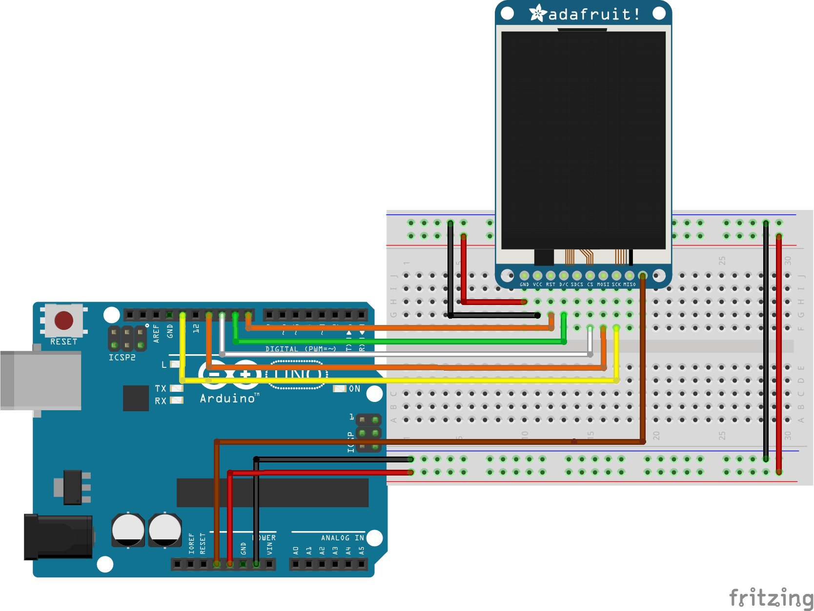

# Adafruit ST7735屏幕驱动库

## 1 简介

本文将介绍如何使用 [RT-Thread 已经支持 RTduino 的 BSP](/zh/beginner/bsp-develop?id=_2-已经支持rtduino的bsp) 将 Adafruit ST7735 屏幕驱动库在 RTduino/RT-Thread 环境下运行起来。

Adafruit 是一个海外 Arduino 开源硬件社区，其贡献了[大量 Arduino 驱动库](https://github.com/orgs/adafruit/repositories?language=c%2B%2B&type=all)。

### 1.1 仓库地址

- 官方（Github）：https://github.com/adafruit/Adafruit-ST7735-Library
- 镜像源（Gitee）：https://gitee.com/RT-Thread-Mirror/Adafruit-ST7735-Library

### 1.2 自动依赖Arduino库

- [Adafruit GFX](/zh/library-examples/display/Adafruit/Adafruit-GFX-Library/Adafruit-GFX-Library)

### 1.3 BSP要求

- 已对接RT-Thread SPI设备驱动框架
- 已对接RTduino SPI

## 2 ST7735 TFT屏幕驱动芯片

ST7735是一款高性能的TFT屏幕驱动芯片，由 Sitronix 公司推出。其支持多种分辨率和尺寸，包括128x160、128x128等，具备出色的16/18位色深，为用户提供细腻生动的图像显示。适用于嵌入式系统、便携设备及DIY电子项目，可通过SPI和8位并行接口实现快速而灵活的数据传输。

```pdf
https://www.displayfuture.com/Display/datasheet/controller/ST7735.pdf
```

## 3 如何运行Adafruit ST7735库

### 3.1 开启RTduino

在 BSP 根目录下目录下，进入 `menuconfig` 后，先选择 `Compatible with Arduino Ecosystem (RTduino)`，开启 RTduino，让 BSP 具备兼容 Arduino 生态的能力：

```Kconfig
Hardware Drivers Config --->
    Onboard Peripheral Drivers --->
        [*] Compatible with Arduino Ecosystem (RTduino)
```
### 3.2 开启Adafruit ST7735库

Adafruit ST7735 库已经注册到 RT-Thread 软件包中心：

```Kconfig
RT-Thread online packages --->
    Arduino libraries  --->
        Display  --->
             [*] Adafruit ST7735 and ST7789 SPI displays driver
```

### 3.3 硬件连接

如下图所示：




### 3.5 编译运行

用 `scons -j12` 命令编译，并将 `.bin` 或 `.elf` 文件烧录到板卡中。

板卡上电后，可以打开串口终端，调整接收波特率为115200 （RT-Thread默认波特率），即可看到基于RTduino运行Adafruit ST7735驱动库，并驱动ST7735在显示屏上显示基本图案。
