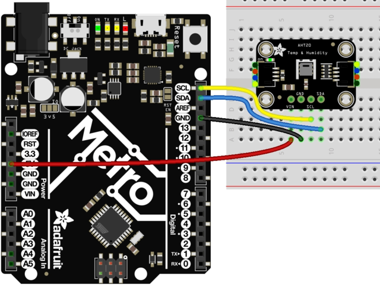

# Adafruit AHT10/20温湿度传感器库

## 1. 简介

本文将介绍如何使用[RT-Thread已经支持RTduino的BSP](/zh/beginner/rtduino?id=_2-已经适配rtduino的rt-thread-bsp)将 Adafruit AHT10/20 温湿度传感器驱动库在RTduino/RT-Thread环境下运行起来。

Adafruit 是一个海外Arduino开源硬件社区，其贡献了[大量Arduino驱动库](https://github.com/orgs/adafruit/repositories?language=c%2B%2B&type=all)。

### 1.1 仓库地址

- 官方（Github）：https://github.com/adafruit/Adafruit_AHTX0
- 镜像源（Gitee）：https://gitee.com/RT-Thread-Mirror/Adafruit_AHTX0

### 1.2 自动依赖Arduino库

- [Adafruit BusIO](/zh/library-examples/signal-io/Adafruit/Adafruit-BusIO/Adafruit-BusIO)

### 1.3 自动依赖RT-Thread软件包

- RTduino

### 1.4 BSP要求

- 已对接RT-Thread I2C设备驱动框架
- 已对接RTduino Wire(I2C)

## 2. AHT10温湿度传感器

```pdf
https://datasheet.lcsc.com/lcsc/1912111437_Aosong--Guangzhou-Elec-AHT10_C368909.pdf
```

## 3. 如何运行Adafruit AHT10/20库

本节以 `stm32f411-st-nucleo` BSP为例，讲解如何运行Adafruit AHTx0驱动库。

### 3.1 开启RTduino

使用Env进入 `menuconfig` 后，先选择 `Compatible with Arduino Ecosystem (RTduino)`，让BSP具备兼容Arduino生态的能力：

```Kconfig
Hardware Drivers Config --->
    Onboard Peripheral Drivers --->
        [*] Compatible with Arduino Ecosystem (RTduino)
```

### 3.2 开启Adafruit AHT10/20库

Adafruit AHTx0库已经注册到RT-Thread软件包中心：

```Kconfig
RT-Thread online packages --->
    Arduino libraries  --->
        Sensors  --->
             [*] Adafruit AHT10 & AHT20: Humidity and Temperature Sensor
```

### 3.3 硬件连接

AHT10传感器，使用I2C总线通信，将其与 STM32F411 Nucleo板的 D14(SDA) 和 D15(SCL) 相连接（注意不是A4、A5），并连接VCC和GND。如图所示：



### 3.4 驱动 AHT10

接下来就可以编写程序调用Adafruit AHT10/20库的接口（API）来驱动AHT10了。

打开 BSP 工程下的 `packages\Adafruit-AHTX0-latest\examples\adafruit_aht_test\adafruit_aht_test.ino` 示例文件，将其内容全部拷贝覆盖到 `applications\arduino_main.cpp` 中。

**唯一需要修改的地方是串口波特率**，在Arduino给的示例代码中串口波特率初始化为9600，但是RT-Thread串口设备框架默认使用的是115200，因此请将`Serial.begin(9600);` 改为 `Serial.begin();` 无参数即可。这样就使用RT-Thread串口设备框架的默认波特率。

### 3.5 编译运行

用 `scons -j12` 命令编译，并将 `.bin` 或 `.elf` 文件烧录到板卡中。

板卡上电后，可以打开串口终端，调整接收波特率为115200 （RT-Thread默认波特率），即可看到基于RTduino运行Adafruit AHT10/20 Arduino驱动库获取的AHT10芯片实时温湿度数据。
