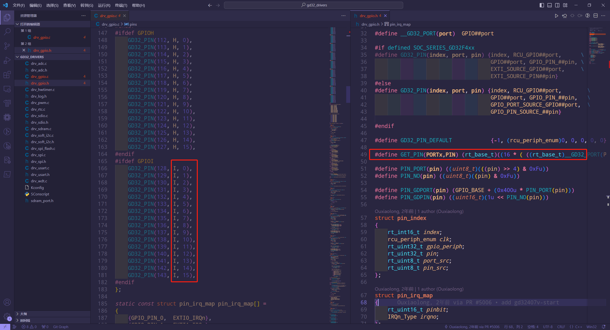
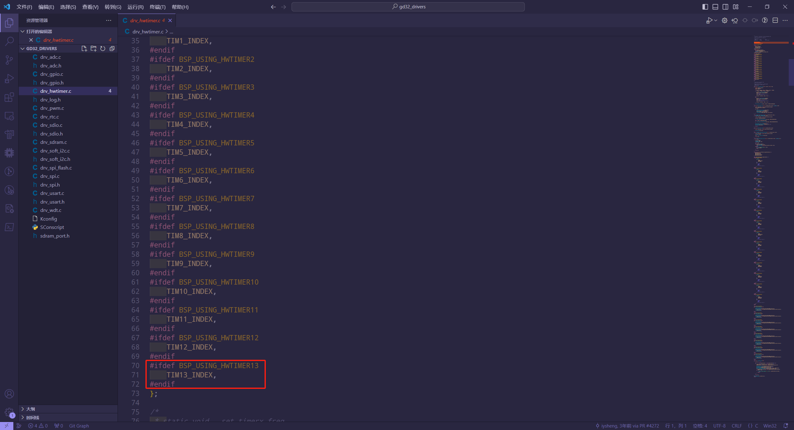
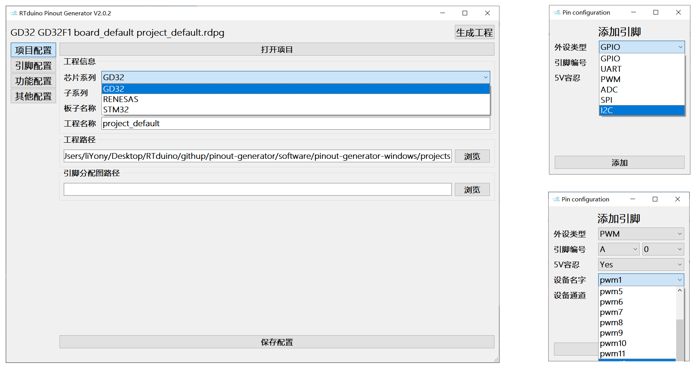

# 如何新增MCU支持

pinout-generator 软件主要是为了帮助用户快速实现bsp快速对接RTduino兼容层开发的一款自动化代码生成工具，在V2.0版本中，引入了多MCU支持特性，用户通过简单修改即可为其适配不同的MCU，下面以GD32系列为例，为大家展示一下如何进行MCU适配。

## 1. 复制一份STM32的适配文件作为模板(json格式)

```json
{
    "series": "STM32",
    "date": "2023-12-02",
    "author": "liYony",
    "childseries":[
        "STM32F0",
        "STM32F1",
        "STM32F2",
        "STM32F3",
        "STM32F4",
        "STM32F7",
        "STM32G0",
        "STM32G4",
        "STM32H7",
        "STM32L0",
        "STM32L1",
        "STM32L4",
        "STM32L5"
    ],
    "pininfo": {
        "format": "GET_PIN((port), (pin))",
        "ports": [
            "A",
            "B",
            "C",
            "D",
            "E",
            "F",
            "G",
            "H",
            "I",
            "J",
            "K",
            "Z"
        ],
        "pins": [
            "0",
            "1",
            "2",
            "3",
            "4",
            "5",
            "6",
            "7",
            "8",
            "9",
            "10",
            "11",
            "12",
            "13",
            "14",
            "15"
        ]
    },
    "timers":[
        "timer1",
        "timer2",
        "timer3",
        "timer4",
        "timer5",
        "timer6",
        "timer7",
        "timer8",
        "timer9",
        "timer10",
        "timer11",
        "timer12",
        "timer13",
        "timer14",
        "timer15",
        "timer16",
        "timer17"
    ],
    "iofunctions": [
        {
            "function": "GPIO",
            "help": "this is help.",
            "support": true,
            "ioremaps": [],
            "names": [],
            "channels": []
        },
        {
            "function": "UART",
            "help": "this is help.",
            "support": true,
            "ioremaps": [
                "TX",
                "RX"
            ],
            "names": [
                "uart1",
                "uart2",
                "uart3",
                "uart4",
                "uart5",
                "uart6",
                "uart7",
                "uart8",
                "lpuart1"
            ],
            "channels": []
        },
        {
            "function": "PWM",
            "help": "this is help.",
            "support": true,
            "ioremaps": [],
            "names": [
                "pwm1",
                "pwm2",
                "pwm3",
                "pwm4",
                "pwm5",
                "pwm6",
                "pwm7",
                "pwm8",
                "pwm9",
                "pwm10",
                "pwm11",
                "pwm12",
                "pwm13",
                "pwm14",
                "pwm15",
                "pwm16",
                "pwm17",
                "pwm18"
            ],
            "channels": [
                "-4",
                "-3",
                "-2",
                "-1",
                "1",
                "2",
                "3",
                "4"
            ]
        },
        {
            "function": "ADC",
            "help": "this is help.",
            "support": true,
            "ioremaps": [],
            "names": [
                "adc1",
                "adc2",
                "adc3"
            ],
            "channels": [
                "0",
                "1",
                "2",
                "3",
                "4",
                "5",
                "6",
                "7",
                "8",
                "9",
                "10",
                "11",
                "12",
                "13",
                "14",
                "15",
                "16",
                "17",
                "18",
                "19",
                "VREFINT",
                "VBAT",
                "TEMPSENSOR"
            ]
        },
        {
            "function": "DAC",
            "help": "this is help.",
            "support": true,
            "ioremaps": [],
            "names": [
                "dac1",
                "dac2"
            ],
            "channels": [
                "1",
                "2"
            ]
        },
        {
            "function": "SPI",
            "help": "this is help.",
            "support": true,
            "ioremaps": [
                "MISO",
                "MOSI",
                "SCK"
            ],
            "names": [
                "spi1",
                "spi2",
                "spi3",
                "spi4",
                "spi5",
                "spi6"
            ],
            "channels": []
        },
        {
            "function": "I2C",
            "help": "this is help.",
            "support": true,
            "ioremaps": [
                "SCL",
                "SDA"
            ],
            "names": [
                "i2c1",
                "i2c2",
                "i2c3",
                "i2c4"
            ],
            "channels": []
        },
        {
            "function": "USB",
            "help": "this is help.",
            "support": true,
            "ioremaps": [
                "DP",
                "DM"
            ],
            "names": [
                "usb",
                "usbd",
                "usbh"
            ],
            "channels": []
        }
    ]
}
```

这里对各个参数进行一个简单介绍：
- series：系列名称
- date：创建日期
- author：创建作者
- childseries：子系列(数组)，目前暂未使用到。
- pininfo
  - format：格式，`(port)`和`(pin)`会被下面的ports、pins数组中的值替换。
  - ports：GPIO端口(数组)
  - pins：GPIO引脚(数组)
- timers：支持的定时器
- iofunctions：所有支持的引脚功能(数组)
  - function：具体的功能名称，例如SPI、I2C、PWM和ADC等。
  - help：帮助信息，按需填写。
  - support：是否支持，bool类型
  - ioremaps：功能具备的引脚功能，例如UART功能的引脚有TX、RX功能。
  - names：RT-Thread对应的设备名称
  - channels：支持的通道，例如ADC功能有1、2、3等等通道。若没有通道可不用填写。

## 2. 编写GD32适配文件

这些适配信息可参考rt-thread每个MCU系列对应的驱动文件中查看。

### 2.1 基本信息

```json
"series": "GD32",
"date": "2023-12-26",
"author": "liYony",
"childseries":[
    "GD32F1",
    "GD32F2",
    "GD32F3"
],
```

### 2.2 引脚格式信息



根据GD32的drv_gpio.c和drv_gpio.h驱动文件可以看出，GD32支持的端口为A~I，支持的引脚为0~15，引脚格式为GET_PIN((port), (pin))。所以编写Json内容如下：

```json
"pininfo": {
    "format": "GET_PIN((port), (pin))",
    "ports": [
        "A",
        "B",
        "C",
        "D",
        "E",
        "F",
        "G",
        "H",
        "I"
    ],
    "pins": [
        "0",
        "1",
        "2",
        "3",
        "4",
        "5",
        "6",
        "7",
        "8",
        "9",
        "10",
        "11",
        "12",
        "13",
        "14",
        "15"
    ]
}
```

### 2.3 添加timer信息



根据GD32的drv_hwtimer.c驱动文件可以看出，GD32支持的TIMER为timer1~timer13。所以编写Json内容如下：

```json
"timers":[
    "timer1",
    "timer2",
    "timer3",
    "timer4",
    "timer5",
    "timer6",
    "timer7",
    "timer8",
    "timer9",
    "timer10",
    "timer11",
    "timer12",
    "timer13"
]
```

### 2.4 添加引脚功能

#### 2.4.1 GPIO功能

```json
{
    "function": "GPIO",
    "help": "this is help.",
    "support": true,
    "ioremaps": [],
    "names": [],
    "channels": []
}
```

#### 2.4.2 UART功能

根据GD32的drv_usart.c驱动文件可以看出，GD32支持的UART为uart1~uart7。所以编写Json内容如下：

```json
{
    "function": "UART",
    "help": "this is help.",
    "support": true,
    "ioremaps": [
        "TX",
        "RX"
    ],
    "names": [
        "uart1",
        "uart2",
        "uart3",
        "uart4",
        "uart5",
        "uart6",
        "uart7"
    ],
    "channels": []
}
```

#### 2.4.3 PWM功能

根据GD32的drv_pwm.c驱动文件可以看出，GD32支持的PWM为pwm1~pwm14，通道为0~3。所以编写Json内容如下：

```json
{
    "function": "PWM",
    "help": "this is help.",
    "support": true,
    "ioremaps": [],
    "names": [
        "pwm1",
        "pwm2",
        "pwm3",
        "pwm4",
        "pwm5",
        "pwm6",
        "pwm7",
        "pwm8",
        "pwm9",
        "pwm10",
        "pwm11",
        "pwm12",
        "pwm13",
        "pwm14"
    ],
    "channels": [
        "0",
        "1",
        "2",
        "3"
    ]
}
```

#### 2.4.4 ADC功能

根据GD32的drv_adc.c驱动文件可以看出，GD32支持的ADC为adc0~adc2，通道为0~15。所以编写Json内容如下：

```json
{
    "function": "ADC",
    "help": "this is help.",
    "support": true,
    "ioremaps": [],
    "names": [
        "adc0",
        "adc1",
        "adc2"
    ],
    "channels": [
        "0",
        "1",
        "2",
        "3",
        "4",
        "5",
        "6",
        "7",
        "8",
        "9",
        "10",
        "11",
        "12",
        "13",
        "14",
        "15"
    ]
}
```

#### 2.4.5 DAC功能

因为GD32目前暂时不支持DAC驱动，所以请设置support为false。

```json
{
    "function": "DAC",
    "help": "this is help.",
    "support": false,
    "ioremaps": [],
    "names": [],
    "channels": []
}
```

#### 2.4.6 SPI功能

根据GD32的drv_spi.c驱动文件可以看出，GD32支持的SPI为spi0~spi4。所以编写Json内容如下：

```json
{
    "function": "SPI",
    "help": "this is help.",
    "support": true,
    "ioremaps": [
        "MISO",
        "MOSI",
        "SCK"
    ],
    "names": [
        "spi0",
        "spi1",
        "spi2",
        "spi3",
        "spi4"
    ],
    "channels": []
}
```

#### 2.4.7 I2C功能

根据GD32的drv_soft_i2c.c驱动文件可以看出，GD32支持的I2C为i2c0~i2c3。所以编写Json内容如下：

```json
{
    "function": "I2C",
    "help": "this is help.",
    "support": true,
    "ioremaps": [
        "SCL",
        "SDA"
    ],
    "names": [
        "i2c0",
        "i2c1",
        "i2c2",
        "i2c3"
    ],
    "channels": []
}
```

#### 2.4.8 USB功能

因为GD32目前暂时不支持USB驱动，所以请设置support为false。

```json
{
    "function": "USB",
    "help": "this is help.",
    "support": false,
    "ioremaps": [],
    "names": [],
    "channels": []
}
```

### 2.5 最终配置文件

```json
{
    "series": "GD32",
    "date": "2023-12-26",
    "author": "liYony",
    "childseries":[
        "GD32F1",
        "GD32F2",
        "GD32F3"
    ],
    "pininfo": {
        "format": "GET_PIN((port), (pin))",
        "ports": [
            "A",
            "B",
            "C",
            "D",
            "E",
            "F",
            "G",
            "H",
            "I"
        ],
        "pins": [
            "0",
            "1",
            "2",
            "3",
            "4",
            "5",
            "6",
            "7",
            "8",
            "9",
            "10",
            "11",
            "12",
            "13",
            "14",
            "15"
        ]
    },
    "timers":[
        "timer1",
        "timer2",
        "timer3",
        "timer4",
        "timer5",
        "timer6",
        "timer7",
        "timer8",
        "timer9",
        "timer10",
        "timer11",
        "timer12",
        "timer13"
    ],
    "iofunctions": [
        {
            "function": "GPIO",
            "help": "this is help.",
            "support": true,
            "ioremaps": [],
            "names": [],
            "channels": []
        },
        {
            "function": "UART",
            "help": "this is help.",
            "support": true,
            "ioremaps": [
                "TX",
                "RX"
            ],
            "names": [
                "uart1",
                "uart2",
                "uart3",
                "uart4",
                "uart5",
                "uart6",
                "uart7"
            ],
            "channels": []
        },
        {
            "function": "PWM",
            "help": "this is help.",
            "support": true,
            "ioremaps": [],
            "names": [
                "pwm1",
                "pwm2",
                "pwm3",
                "pwm4",
                "pwm5",
                "pwm6",
                "pwm7",
                "pwm8",
                "pwm9",
                "pwm10",
                "pwm11",
                "pwm12",
                "pwm13",
                "pwm14"
            ],
            "channels": [
                "0",
                "1",
                "2",
                "3"
            ]
        },
        {
            "function": "ADC",
            "help": "this is help.",
            "support": true,
            "ioremaps": [],
            "names": [
                "adc0",
                "adc1",
                "adc2"
            ],
            "channels": [
                "0",
                "1",
                "2",
                "3",
                "4",
                "5",
                "6",
                "7",
                "8",
                "9",
                "10",
                "11",
                "12",
                "13",
                "14",
                "15"
            ]
        },
        {
            "function": "DAC",
            "help": "this is help.",
            "support": false,
            "ioremaps": [],
            "names": [],
            "channels": []
        },
        {
            "function": "SPI",
            "help": "this is help.",
            "support": true,
            "ioremaps": [
                "MISO",
                "MOSI",
                "SCK"
            ],
            "names": [
                "spi0",
                "spi1",
                "spi2",
                "spi3",
                "spi4"
            ],
            "channels": []
        },
        {
            "function": "I2C",
            "help": "this is help.",
            "support": true,
            "ioremaps": [
                "SCL",
                "SDA"
            ],
            "names": [
                "i2c0",
                "i2c1",
                "i2c2",
                "i2c3"
            ],
            "channels": []
        },
        {
            "function": "USB",
            "help": "this is help.",
            "support": false,
            "ioremaps": [],
            "names": [],
            "channels": []
        }
    ]
}
```

## 3. 效果展示


