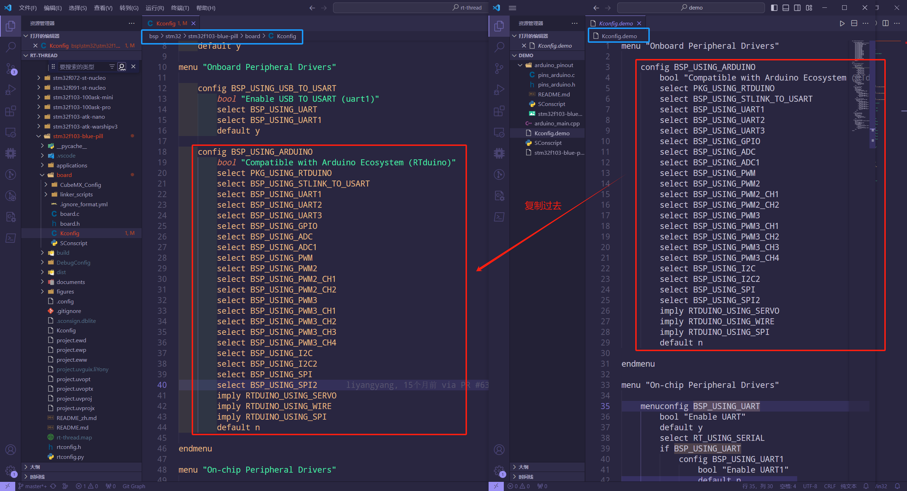

# 为 STM32 BSP 适配 RTduino

我们以 [STM32F411RE Nucleo-64开发板](https://github.com/RT-Thread/rt-thread/tree/master/bsp/stm32/stm32f411-st-nucleo/applications/arduino_pinout) 为例，讲解如何使用 pinout-generator 工具辅助对接 RTduino。

## 1 检查是否具有底层驱动

由于本次对接的是STM32系列的单片机，驱动文件是非常完善的，如下：


但是，如果大家对接的单片机是一些使用比较少的单片机，这些驱动文件或许并没有完全实现，大家可以自行实现或者去社区求助。

## 2 CubeMX软件配置（STM32必须的，其他系列不一定）


### 2.1 ADC


### 2.2 PWM


STM32对接PWM教程：https://www.rt-thread.org/document/site/#/rt-thread-version/rt-thread-standard/application-note/driver/pwm/an0037-rtthread-driver-pwm?id=%e6%b7%bb%e5%8a%a0-pwm-%e9%a9%b1%e5%8a%a8

### 2.3 UART


### 2.4 SPI

由于与PWM冲突，这里我们不对接SPI。**注意：凡是支持Arduino插槽的开发板，均不对接SPI，都对接PWM！** 如果想要对接SPI，可以在非Arduino插槽的位置找一组引脚对接SPI。

### 2.5 I2C

RT-Thread使用的软件模拟I2C，所以我们可以直接使用GPIO框架。

### 2.6 生成工程，删除多余代码


src里面：


## 3 编写Kconfig

### 3.1 On-chip Peripheral Drivers

#### 3.1.1 UART

```Kconfig
menuconfig BSP_USING_UART
    bool "Enable UART"
    default n
    select RT_USING_SERIAL
    if BSP_USING_UART
        config BSP_USING_UART2
            bool "Enable UART2"
            default n

        config BSP_UART2_RX_USING_DMA
            bool "Enable UART2 RX DMA"
            depends on BSP_USING_UART2 && RT_SERIAL_USING_DMA
            default n
    endif
```

#### 3.1.2 ADC

```Kconfig
menuconfig BSP_USING_ADC
    bool "Enable ADC"
    default n
    select RT_USING_ADC
    if BSP_USING_ADC
        config BSP_USING_ADC1
            bool "Enable ADC1"
            default n
    endif
```

#### 3.1.3 PWM

```Kconfig
menuconfig BSP_USING_PWM
    bool "Enable PWM"
    default n
    select RT_USING_PWM

    if BSP_USING_PWM
        menuconfig BSP_USING_PWM1
            bool "Enable timer1 output PWM"
            default n
            if BSP_USING_PWM1
                config BSP_USING_PWM1_CH1
                    bool "Enable PWM1 channel1"
                    default n
            endif

        menuconfig BSP_USING_PWM2
            bool "Enable timer2 output PWM"
            default n
            if BSP_USING_PWM2
                config BSP_USING_PWM2_CH2
                    bool "Enable PWM2 channel2"
                    default n

                config BSP_USING_PWM2_CH3
                    bool "Enable PWM2 channel3"
                    default n
            endif

        menuconfig BSP_USING_PWM3
            bool "Enable timer3 output PWM"
            default n
            if BSP_USING_PWM3
                config BSP_USING_PWM3_CH1
                    bool "Enable PWM3 channel1"
                    default n

                config BSP_USING_PWM3_CH2
                    bool "Enable PWM3 channel2"
                    default n
            endif
        
        menuconfig BSP_USING_PWM4
            bool "Enable timer4 output PWM"
            default n
            if BSP_USING_PWM4
                config BSP_USING_PWM4_CH1
                    bool "Enable PWM4 channel1"
                    default n
            endif
    endif
```

#### 3.1.4 I2C

```Kconfig
menuconfig BSP_USING_I2C
    bool "Enable I2C BUS"
    default n
    select RT_USING_I2C
    select RT_USING_I2C_BITOPS
    select RT_USING_PIN

    if BSP_USING_I2C
        config BSP_USING_I2C1
            bool "Enable I2C1 Bus (User I2C)"
            default n
            if BSP_USING_I2C1
                comment "Notice: PB9 --> 25; PB8 --> 24" 
                config BSP_I2C1_SCL_PIN
                    int "i2c1 SCL pin number"
                    range 1 176
                    default 24
                config BSP_I2C1_SDA_PIN
                    int "i2c1 SDA pin number"
                    range 1 176
                    default 25
            endif
    endif
```

### 3.2 Onboard Peripheral Drivers

```Kconfig
config BSP_USING_STLINK_TO_USART
    bool "Enable STLINK TO USART (uart2)"
    select BSP_USING_UART
    select BSP_USING_UART2
    default y
```

## 4 pinout-generator工具

剩下的就可以使用一个软件来完成！

pinout-generator是为了方便用户将BSP对接到[RTduino](https://github.com/RTduino/RTduino)上而设计的一个自动化源文件生成工具。下面介绍如何使用本软件，并将该BSP对接到RTduino上。

### 4.1 创建工程项目

打开软件，进入**项目配置**页面。根据本次示例板卡，配置信息如下图。


> ⚠️注意：
>
> 完成项目配置后，请点击**保存配置**。

### 4.2 进入引脚配置

根据引脚分配图填写引脚配置。在空白页**右键菜单**唤起菜单项进行引脚添加或其他。


完成引脚配置如下：


### 4.3 进行功能配置

首先，了解一下各选项的一个含义：

- Serial2：除了RTduino终端串口另外支持的串口。
- Serial3：除了RTduino终端串口另外支持的串口。
- Timer：RTduino需要的默认定时器。
- SPI设备名称：RTduino需要的默认SPI设备。
- SPI-SS：SPI设备的SS(片选)引脚的编号。
- LED引脚：RTduino默认的LED灯引脚。
- I2C设备名称：RTduino需要的默认I2C设备。
- 示例程序：RTduino对接Demo程序。
  - 循环打印<Hello！Arduino>。
  - LED灯以一定频率闪烁。
- 作者信息：对接BSP的作者。
- 工作频率：表示BSP工作的主频，是必填项。
- PWM转SPI配置：部分BSP因为资源受限，可能会将已经对接的PWM设备引脚用作SPI的引脚，但是这里生成的代码仅仅只是一个框架，仍需用户**自行补充**(具体操作见下文)。

根据BSP需求，具体配置信息如下：


### 4.4 生成代码

截至到这，已经完成了基本的对接配置工作，可以生成对应的工程了。


这里对生成的文件进行一个简单的介绍：

- arduino_pinout
  - pins_arduino.c：保存了RT-Thread引脚和RTduino引脚的对应关系。
  - pins_arduino.h：保存了RTduino功能配置相关宏定义。
  - README.md：说明文档。
  - SConscript：RT-Thread工程构建脚本。
  - stm32f103-blue-pill-pinout.jpg：引脚分配图。
- arduino_main.cpp：RTduino示例代码。
- Kconfig.demo：menuconfig相关代码，这里需要**简单移植**(具体操作见下文)。
- SConscript：RT-Thread工程构建脚本。
- stm32f103-blue-pill.rdpg：pinout-generator的工程文件，用户可双击打开。

### 4.5 用户需自行修改

#### 4.5.1 Kconfig移植

将`Kconfig.demo`里卖的`Onboard Peripheral Drivers`和`On-chip Peripheral Drivers`的内容拷贝至bsp的board文件夹中的Kconfig文件(BSP根目录/board/Kconfig)，下图为`Onboard Peripheral Drivers`内容的拷贝示例。



#### 4.5.2 PWM转SPI代码移植(非必要，不支持可跳过此章节)

这里我们配置pwm转spi的spi设备为`spi1`来进行一个本章节的简要介绍。


> ⚠️注意：
>
> 这次只是单纯使用CubeMX生成跟SPI引脚初始化有关的代码，生成完代码后，建议重新恢复CubeMX工程。

当选择了pwm转spi后，`pins_arduino.c`文件会生成如下代码，根据注释补充完整即可。补充完整请自行删除`#error`编译报警。


## 5 完善代码


## 6 编写README.md文件

参考其他[已经适配RTduino的BSP](/zh/beginner/rtduino?id=已经适配rtduino的rt-thread-bsp)编写。
