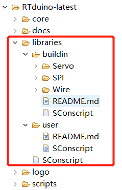

# RTduino文件夹目录结构

RTduino 软件包包含有两个主要的文件夹：**core** 和 **libraries**。

- **core 文件夹**主要是提供 Arduino 内置的所有的 API 函数，例如 `analogWrite()`、`analogRead()` 等函数，这些函数可以在 [Arduino 官方](https://www.arduino.cc/reference/en/)找到详细的介绍，也可以参考 [Arduino API 可兼容性一览表](/zh/manual/api/api-compatibility)。

- **libraries 文件夹**是 Arduino 库所在文件夹。其中：
  
  - **buildin 文件夹**下存放着一些 Arduino 内置库，例如 Servo 舵机驱动库，Wire(I2C) 驱动库等等；
  
  - **user 文件夹**是用户文件夹，这是对用户来说很重要的一个文件夹，里边默认是空的，用户可以把下载好的 Arduino 社区库拖入到此文件夹中来。参见[手动导入 Arduino 社区库](/zh/manual/libraries/community-libraries?id=手动导入arduino社区库)。
