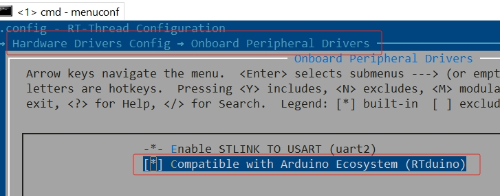
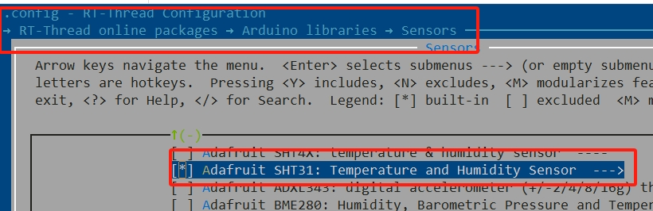

# Adafruit SHT31温湿度传感器库

## 1. 简介

本文将介绍如何使用[RT-Thread已经支持RTduino的BSP](/zh/beginner/rtduino?id=_2-已经适配rtduino的rt-thread-bsp)将Adafruit SHT31温湿度传感器驱动库在RTduino/RT-Thread环境下运行起来。

Adafruit 是一个海外Arduino开源硬件社区，其贡献了[大量Arduino驱动库](https://github.com/orgs/adafruit/repositories?language=c%2B%2B&type=all)。

## 2. SHT31 温湿度传感器

SHT3x是一款由瑞士Sensirion生产的高精度温湿度传感器。其特点主要为：

- Fully calibrated, linearized, and temperature compensated digital output
- Wide supply voltage range, from 2.4 V to 5.5 V
- I2C Interface with communication speeds up to 1 MHz and two user selectable addresses
- Typical accuracy of ± 1.5 % RH and ± 0.2 °C for SHT35
- Very fast start-up and measurement time
- Tiny 8-Pin DFN package

SHT31详细数据可参见[芯片手册](https://www.mouser.com/datasheet/2/682/Sensirion_Humidity_Sensors_SHT3x_Datasheet_digital-971521.pdf)。

## 3. 如何运行Adafruit SHT31库

本节以 `stm32f411-st-nucleo` BSP为例，讲解如何运行Adafruit SHT31驱动库。

### 3.1 开启RTduino

使用Env进入 `menuconfig` 后，先选择 `Compatible with Arduino Ecosystem (RTduino)`，让BSP具备兼容Arduino生态的能力：

```Kconfig
Hardware Drivers Config --->
    Onboard Peripheral Drivers --->
        [*] Compatible with Arduino Ecosystem (RTduino)
```



### 3.2 开启Adafruit SHT31库

Adafruit SHT31库已经注册到RT-Thread软件包中心：

```Kconfig
RT-Thread online packages --->
    Arduino libraries  --->
        Sensors  --->
            [*] Adafruit SHT31: Temperature and Humidity Sensor
```



### 3.3 驱动SHT31

接下来就可以编写程序调用Adafruit SHT31库的接口（API）来驱动SHT31了。

打开 BSP 工程下的 `packages\Adafruit-SHT31-latest\examples\SHT31test\SHT31test.ino` 示例文件，将其内容全部拷贝覆盖到 `applications\arduino_main.cpp` 中。

**唯一需要修改的地方是串口波特率**，在Arduino给的示例代码中串口波特率初始化为9600，但是RT-Thread串口设备框架默认使用的是115200，因此请将`Serial.begin(9600);` 改为 `Serial.begin();` 无参数即可。这样就使用RT-Thread串口设备框架的默认波特率。

### 3.4 编译运行

用 `scons -j12` 命令编译，并将 `.bin` 或 `.elf` 文件烧录到板卡中。

板卡上电后，可以打开串口终端，调整接收波特率为115200 （RT-Thread默认波特率），即可看到基于RTduino运行Adafruit SHT31 Arduino驱动库获取的SHT31芯片实时温湿度数据：


